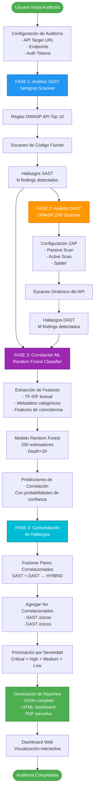

```mermaid
flowchart TB
    Start([Usuario Inicia Auditoría]) --> Config[ Configuración de Auditoría<br/>- API Target URL<br/>- Endpoints<br/>- Auth Tokens]
    
    Config --> SAST[FASE 1: Análisis SAST<br/>Semgrep Scanner]
    
    SAST --> SASTRules[Reglas OWASP API Top 10]
    SASTRules --> SASTScan[Escaneo de Código Fuente]
    SASTScan --> SASTFindings[Hallazgos SAST<br/>N findings detectados]
    
    SASTFindings --> DAST[FASE 2: Análisis DAST<br/>OWASP ZAP Scanner]
    
    DAST --> ZAPConfig[Configuración ZAP<br/>- Passive Scan<br/>- Active Scan<br/>- Spider]
    ZAPConfig --> ZAPScan[Escaneo Dinámico del API]
    ZAPScan --> DASTFindings[Hallazgos DAST<br/>M findings detectados]
    
    SASTFindings --> Correlation[FASE 3: Correlación ML<br/>Random Forest Classifier]
    DASTFindings --> Correlation
    
    Correlation --> FeatureExtraction[Extracción de Features<br/>- TF-IDF textual<br/>- Metadatos categóricos<br/>- Features de coincidencia]
    
    FeatureExtraction --> MLModel[Modelo Random Forest<br/>200 estimadores<br/>Depth=20]
    
    MLModel --> Predictions[Predicciones de Correlación<br/>Con probabilidades de confianza]
    
    Predictions --> Consolidation[FASE 4: Consolidación<br/>de Hallazgos]
    
    Consolidation --> MergeCorrelated[Fusionar Pares Correlacionados<br/>SAST + DAST → HYBRID]
    
    MergeCorrelated --> AddUncorrelated[Agregar No Correlacionados<br/>- SAST únicos<br/>- DAST únicos]
    
    AddUncorrelated --> Prioritization[Priorización por Severidad<br/>Critical > High > Medium > Low]
    
    Prioritization --> Report[Generación de Reportes<br/>- JSON completo<br/>- HTML dashboard<br/>- PDF ejecutivo]
    
    Report --> Dashboard[Dashboard Web<br/>Visualización interactiva]
    
    Dashboard --> End([Auditoría Completada])
    
    style Start fill:#4CAF50,stroke:#2E7D32,color:#fff
    style SAST fill:#2196F3,stroke:#1565C0,color:#fff
    style DAST fill:#FF9800,stroke:#E65100,color:#fff
    style Correlation fill:#9C27B0,stroke:#6A1B9A,color:#fff
    style Consolidation fill:#00BCD4,stroke:#006064,color:#fff
    style Report fill:#4CAF50,stroke:#2E7D32,color:#fff
    style End fill:#4CAF50,stroke:#2E7D32,color:#fff
```