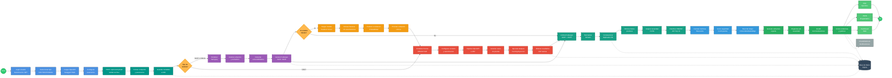

```mermaid
flowchart LR
    %% Inicio
    START((Inicio)) --> A1[Login Usuario<br/>Autenticacion JWT]
    
    %% Usuario/Frontend
    A1 --> A2[Seleccionar tipo<br/>SAST/DAST/Hibrido]
    A2 --> A3[Cargar OpenAPI<br/>Swagger/YAML]
    A3 --> A4[Configurar<br/>parametros]
    
    %% API Gateway
    A4 --> B1[POST /api/scan/upload<br/>Validar archivo]
    B1 --> B2[Extraer endpoints<br/>y parametros]
    B2 --> B3[Guardar metadata<br/>en BD]
    
    %% Decision de tipo de analisis
    B3 --> DECISION{Tipo de<br/>analisis?}
    
    %% Rama SAST
    DECISION -->|SAST o Hibrido| C1[Inicializar<br/>Semgrep]
    C1 --> C2[Analisis sintactico<br/>y semantico]
    C2 --> C3[Detectar<br/>vulnerabilidades]
    C3 --> C4[Generar hallazgos<br/>SAST JSON]
    
    %% Rama decision hibrido
    C4 --> HYBRID{Es analisis<br/>hibrido?}
    
    %% Correlacion ML
    HYBRID -->|Si| D1[Cargar modelo<br/>Random Forest]
    D1 --> D2[Extraer features<br/>15 caracteristicas]
    D2 --> D3[Predecir correlacion<br/>Probabilidad]
    D3 --> D4[Priorizar endpoints<br/>criticos]
    
    %% DAST
    DECISION -->|DAST| E1
    D4 --> E1[Inicializar Docker<br/>OWASP ZAP]
    E1 --> E2[Configurar contexto<br/>y autenticacion]
    E2 --> E3[Importar OpenAPI<br/>a ZAP]
    E3 --> E4[Generar casos<br/>de prueba]
    E4 --> E5[Ejecutar ataques<br/>Fuzzing/Inyeccion]
    E5 --> E6[Obtener resultados<br/>ZAP alertas]
    
    %% Consolidacion
    HYBRID -->|No| F1
    C4 --> F1[Unificar hallazgos<br/>SAST + DAST]
    E6 --> F1
    F1 --> F2[Normalizar<br/>formato]
    F2 --> F3[Correlacionar<br/>duplicados ML]
    F3 --> F4[Eliminar falsos<br/>positivos]
    F4 --> F5[Asignar severidad<br/>CVSS]
    F5 --> F6[Clasificar OWASP<br/>API Top 10]
    
    %% Evaluacion
    F6 --> G1[Calcular metricas<br/>Total vulns]
    G1 --> G2[Score seguridad<br/>0-100 puntos]
    G2 --> G3[Nivel de riesgo<br/>Critico/Alto/Medio/Bajo]
    
    %% Reportes
    G3 --> H1[Generar estructura<br/>reporte]
    H1 --> H2[Organizar por<br/>severidad]
    H2 --> H3[Anadir<br/>recomendaciones]
    H3 --> H4[Incluir evidencias<br/>y graficos]
    
    %% Salidas
    H4 --> OUT1[PDF<br/>Ejecutivo]
    H4 --> OUT2[JSON<br/>Programatico]
    H4 --> OUT3[Dashboard<br/>Web]
    
    %% Finalizacion
    OUT1 --> END1((Fin))
    OUT2 --> END1
    OUT3 --> END1
    
    %% Base de datos (conexiones punteadas)
    B3 -.-> DB[(Base de Datos<br/>SQLite)]
    C4 -.-> DB
    E6 -.-> DB
    F3 -.-> DB
    H4 -.-> DB
    
    %% Notificaciones
    H4 -.-> NOTIF[Email/Webhook<br/>Notificaciones]
    
    %% Estilos
    classDef startEnd fill:#2ECC71,stroke:#27AE60,stroke-width:4px,color:#fff
    classDef userStyle fill:#4A90E2,stroke:#2E5C8A,stroke-width:2px,color:#fff
    classDef apiStyle fill:#009688,stroke:#00695C,stroke-width:2px,color:#fff
    classDef decisionStyle fill:#FFB84D,stroke:#E59400,stroke-width:3px,color:#000
    classDef sastStyle fill:#9B59B6,stroke:#7D3C98,stroke-width:2px,color:#fff
    classDef mlStyle fill:#F39C12,stroke:#D68910,stroke-width:2px,color:#fff
    classDef dastStyle fill:#E74C3C,stroke:#C0392B,stroke-width:2px,color:#fff
    classDef consolidacionStyle fill:#16A085,stroke:#117A65,stroke-width:2px,color:#fff
    classDef evaluacionStyle fill:#3498DB,stroke:#2471A3,stroke-width:2px,color:#fff
    classDef reportesStyle fill:#27AE60,stroke:#1E8449,stroke-width:2px,color:#fff
    classDef outputStyle fill:#50C878,stroke:#3AA65D,stroke-width:3px,color:#fff
    classDef dbStyle fill:#34495E,stroke:#212F3C,stroke-width:2px,color:#fff
    classDef notifStyle fill:#95A5A6,stroke:#7B7D7D,stroke-width:2px,color:#fff
    
    class START,END1 startEnd
    class A1,A2,A3,A4 userStyle
    class B1,B2,B3 apiStyle
    class DECISION,HYBRID decisionStyle
    class C1,C2,C3,C4 sastStyle
    class D1,D2,D3,D4 mlStyle
    class E1,E2,E3,E4,E5,E6 dastStyle
    class F1,F2,F3,F4,F5,F6 consolidacionStyle
    class G1,G2,G3 evaluacionStyle
    class H1,H2,H3,H4 reportesStyle
    class OUT1,OUT2,OUT3 outputStyle
    class DB dbStyle
    class NOTIF notifStyle
```