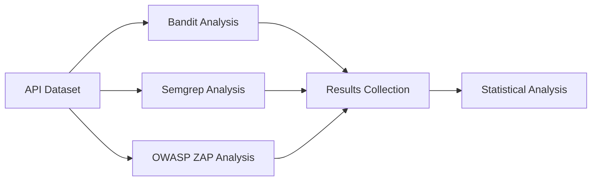

# Capítulo 3: Metodología de Investigación

## 3.1 Tipo de Investigación

Esta investigación se clasifica como **aplicada experimental** con enfoque cuantitativo, ya que busca desarrollar una solución tecnológica práctica al problema identificado y validar su efectividad mediante experimentos controlados.

### 3.1.1 Enfoque Metodológico
- **Paradigma**: Positivista-pragmático
- **Naturaleza**: Cuantitativa con elementos cualitativos
- **Temporalidad**: Transversal con seguimiento longitudinal
- **Alcance**: Descriptivo-explicativo

## 3.2 Diseño de la Investigación

### 3.2.1 Diseño Experimental
Se empleará un **diseño cuasi-experimental con grupo de control** para comparar:
- **Grupo experimental**: Sistema HybridSecScan (SAST + DAST + Correlación)
- **Grupos de control**: Herramientas individuales (Bandit, Semgrep, OWASP ZAP)

### 3.2.2 Variables de Estudio

#### Variables Independientes:
- Tipo de análisis de seguridad (SAST, DAST, Híbrido)
- Herramienta utilizada (Bandit, Semgrep, ZAP, HybridSecScan)
- Configuración del sistema (parámetros de análisis)

#### Variables Dependientes:
- **Precisión** (P = TP / (TP + FP))
- **Recall** (R = TP / (TP + FN)) 
- **F1-Score** (F1 = 2 × (P × R) / (P + R))
- **Tasa de falsos positivos** (FPR = FP / (FP + TN))
- **Tiempo de análisis** (en segundos)
- **Cobertura de vulnerabilidades** OWASP API Top 10

#### Variables de Control:
- Conjunto de APIs de prueba
- Configuración del entorno de testing
- Criterios de clasificación de vulnerabilidades
- Timeouts de análisis

## 3.3 Población y Muestra

### 3.3.1 Población Objetivo
APIs REST de código abierto hospedadas en repositorios públicos (GitHub, GitLab) que contengan vulnerabilidades documentadas del OWASP API Top 10.

### 3.3.2 Muestra
**Tamaño**: 50 APIs REST seleccionadas mediante muestreo intencional

**Criterios de Inclusión**:
- APIs REST con especificación OpenAPI/Swagger disponible
- Código fuente accesible públicamente
- Documentación de vulnerabilidades conocidas
- Presencia de al menos 3 categorías OWASP API Top 10
- Endpoints funcionales y accesibles

**Criterios de Exclusión**:
- APIs sin documentación técnica
- Servicios inactivos o deprecated  
- APIs con autenticación compleja (OAuth2 multi-tenant)
- Sistemas que requieran configuración específica no portable

### 3.3.3 Distribución de la Muestra
- **APIs vulnerables intencionalmente**: 20 (DVWA, Juice Shop, etc.)
- **APIs de proyectos reales**: 20 (selección de GitHub)
- **APIs académicas/investigación**: 10 (papers citados en estado del arte)

## 3.4 Técnicas e Instrumentos de Recolección

### 3.4.1 Instrumentos de Medición

#### Métricas Primarias:
```python
# Matriz de Confusión
True_Positives = vulnerabilidades_detectadas_correctamente
False_Positives = vulnerabilidades_reportadas_incorrectamente  
True_Negatives = no_vulnerabilidades_identificadas_correctamente
False_Negatives = vulnerabilidades_no_detectadas

# Métricas Derivadas
Precision = TP / (TP + FP)
Recall = TP / (TP + FN)
F1_Score = 2 * (Precision * Recall) / (Precision + Recall)
Accuracy = (TP + TN) / (TP + TN + FP + FN)
```

#### Métricas Secundarias:
- Tiempo promedio de análisis por API
- Cobertura por categoría OWASP
- Número de endpoints analizados
- Profundidad de análisis estático
- Completitud de análisis dinámico

### 3.4.2 Herramientas de Análisis
- **Sistema propuesto**: HybridSecScan v1.0
- **Herramientas de comparación**: Bandit 1.7.5, Semgrep 1.45.0, OWASP ZAP 2.14.0
- **Entorno de ejecución**: Docker containers con configuración controlada
- **Análisis estadístico**: Python (scipy, pandas, matplotlib)

## 3.5 Procedimiento de Evaluación

### 3.5.1 Fase 1: Preparación del Entorno (2 semanas)
1. Configuración de infraestructura de testing
2. Instalación y calibración de herramientas
3. Preparación de conjunto de APIs de prueba
4. Validación de criterios de clasificación

### 3.5.2 Fase 2: Evaluación de Herramientas Individuales (4 semanas)


### 3.5.3 Fase 3: Evaluación del Sistema Híbrido (4 semanas)
1. Ejecución de HybridSecScan sobre el mismo dataset
2. Recolección de métricas de correlación
3. Análisis de efectividad de la fusión SAST+DAST
4. Evaluación de reducción de falsos positivos

### 3.5.4 Fase 4: Análisis Comparativo (2 semanas)
1. Análisis estadístico de resultados
2. Pruebas de significancia (t-test, ANOVA)
3. Generación de gráficos comparativos
4. Interpretación de hallazgos

## 3.6 Validez y Confiabilidad

### 3.6.1 Validez Interna
- **Control de variables confusoras**: Uso del mismo dataset para todas las herramientas
- **Estandarización**: Configuración uniforme de parámetros
- **Replicabilidad**: Documentación completa de procedimientos

### 3.6.2 Validez Externa
- **Diversidad de muestra**: APIs de diferentes dominios y tecnologías
- **Representatividad**: Inclusión de vulnerabilidades reales y sintéticas
- **Generalización**: Resultados aplicables a APIs REST estándar

### 3.6.3 Confiabilidad
- **Consistencia**: Múltiples ejecuciones por API (n=3)
- **Estabilidad**: Análisis en entornos controlados
- **Reproducibilidad**: Código y datos disponibles públicamente

## 3.7 Plan de Análisis de Datos

### 3.7.1 Estadística Descriptiva
- Medidas de tendencia central y dispersión
- Distribuciones de frecuencia por categoría OWASP
- Análisis exploratorio de datos (EDA)

### 3.7.2 Estadística Inferencial
- **Pruebas de normalidad**: Shapiro-Wilk, Kolmogorov-Smirnov
- **Comparación de medias**: t-test independiente, ANOVA
- **Análisis de correlación**: Pearson, Spearman
- **Pruebas no paramétricas**: Mann-Whitney U, Kruskal-Wallis

### 3.7.3 Visualización de Resultados
- Gráficos de barras comparativos
- Box plots de distribución de métricas
- Matrices de correlación
- ROC curves para análisis de rendimiento

## 3.8 Consideraciones Éticas

### 3.8.1 Uso Responsable
- Análisis solo sobre APIs públicas y sistemas de prueba
- No explotación de vulnerabilidades reales
- Respeto a términos de servicio de plataformas

### 3.8.2 Transparencia
- Documentación completa de metodología
- Código fuente disponible bajo licencia MIT
- Datos de evaluación anonimizados y públicos

## 3.9 Limitaciones del Estudio

### 3.9.1 Limitaciones Técnicas
- Análisis limitado a APIs REST con especificación OpenAPI
- Dependencia de disponibilidad de sistemas de prueba
- Posibles falsos negativos por configuración de herramientas

### 3.9.2 Limitaciones Metodológicas  
- Evaluación en entorno controlado vs. producción real
- Clasificación manual de true/false positives sujeta a interpretación
- Temporalidad limitada para análisis longitudinal

### 3.9.3 Limitaciones de Alcance
- Enfoque específico en OWASP API Top 10
- No incluye análisis de performance o usabilidad
- Evaluación limitada a herramientas open source
