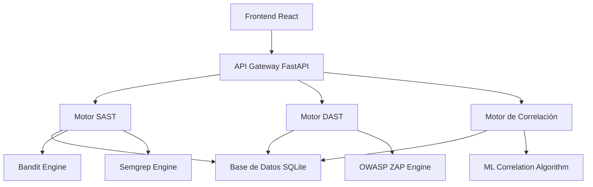

# Capítulo 4: Propuesta del Sistema HybridSecScan

## 4.1 Arquitectura General del Sistema

El sistema HybridSecScan implementa una arquitectura de microservicios que integra análisis estático (SAST), análisis dinámico (DAST) y un motor de correlación inteligente para la detección automatizada de vulnerabilidades OWASP API Top 10.

### 4.1.1 Componentes Principal



### 4.1.2 Flujo de Procesamiento

1. **Entrada**: Upload de código fuente o especificación OpenAPI
2. **Análisis Estático**: Ejecución de Bandit y Semgrep en paralelo
3. **Análisis Dinámico**: Pruebas activas con OWASP ZAP
4. **Correlación Inteligente**: Fusión de hallazgos usando ML
5. **Generación de Reportes**: Output en formatos JSON/PDF/HTML

## 4.2 Motor de Análisis Estático (SAST)

### 4.2.1 Integración de Herramientas

#### Bandit (Python Security Analysis)
```python
def run_bandit_analysis(target_path: str) -> Dict:
    """
    Ejecuta análisis Bandit con configuración optimizada
    para detectar vulnerabilidades OWASP API Top 10
    """
    command = [
        sys.executable, '-m', 'bandit',
        '-r', target_path,
        '-f', 'json',
        '-o', report_path,
        '--confidence-level', 'medium',
        '--severity-level', 'medium'
    ]
    
    result = subprocess.run(command, capture_output=True, timeout=300)
    return parse_bandit_results(result.stdout)
```

#### Semgrep (Multi-language Analysis)
```python  
def run_semgrep_analysis(target_path: str) -> Dict:
    """
    Ejecuta análisis Semgrep con reglas específicas OWASP API
    """
    command = [
        'semgrep',
        '--config', 'owasp-top-ten',
        '--config', 'security-audit', 
        target_path,
        '--json',
        '--output', report_path
    ]
    
    result = subprocess.run(command, capture_output=True, timeout=300)
    return parse_semgrep_results(result.stdout)
```

### 4.2.2 Mapeo a OWASP API Top 10

| Herramienta | API1 BOLA | API2 Auth | API3 Prop Auth | API7 SSRF | API8 Config |
|-------------|-----------|-----------|----------------|-----------|-------------|
| Bandit      | Sí        | Sí        | Parcial        | Sí        | Sí          |
| Semgrep     | Sí        | Sí        | Sí             | Sí        | Sí          |

## 4.3 Motor de Análisis Dinámico (DAST)

### 4.3.1 Integración OWASP ZAP

```python
class DynamicAnalysisEngine:
    def __init__(self):
        self.zap_proxy = ZAPv2(proxy={'http': 'localhost:8080'})
        
    def scan_api_endpoints(self, openapi_spec: Dict) -> Dict:
        """
        Escanea endpoints API basándose en especificación OpenAPI
        """
        vulnerabilities = []
        
        for path, methods in openapi_spec['paths'].items():
            for method, details in methods.items():
                # Configurar autenticación si es requerida
                auth_headers = self.setup_authentication(details)
                
                # Ejecutar pruebas específicas por método
                vuln = self.test_endpoint(path, method, auth_headers)
                vulnerabilities.extend(vuln)
                
        return self.classify_owasp_vulnerabilities(vulnerabilities)
```

### 4.3.2 Pruebas Específicas por Categoría OWASP

#### API1: Broken Object Level Authorization
```python
def test_bola_vulnerability(self, endpoint: str) -> List[Dict]:
    """Prueba manipulación de IDs para acceso no autorizado"""
    base_id = self.extract_id_from_response(endpoint)
    
    test_cases = [
        f"{endpoint.replace(str(base_id), str(base_id + 1))}",
        f"{endpoint.replace(str(base_id), '999999')}",
        f"{endpoint.replace(str(base_id), '-1')}"
    ]
    
    vulnerabilities = []
    for test_url in test_cases:
        response = self.zap_proxy.urlopen(test_url)
        if response.status_code == 200:
            vulnerabilities.append({
                'type': 'BOLA',
                'severity': 'HIGH',
                'endpoint': test_url,
                'evidence': response.text[:500]
            })
    
    return vulnerabilities
```

## 4.4 Motor de Correlación Inteligente

### 4.4.1 Algoritmo de Correlación

La contribución más innovadora del sistema es el algoritmo de correlación que combina hallazgos SAST y DAST para reducir falsos positivos y mejorar la precisión.

```python
class IntelligentCorrelationEngine:
    def __init__(self):
        self.correlation_rules = self.load_correlation_rules()
        self.ml_model = self.load_trained_model()
        
    def correlate_findings(self, sast_results: List, dast_results: List) -> List:
        """
        Correlaciona hallazgos usando múltiples factores:
        1. Similitud de endpoint/archivo
        2. Coincidencia de tipo de vulnerabilidad  
        3. Análisis contextual con ML
        4. Confianza basada en herramientas múltiples
        """
        correlations = []
        
        for sast_finding in sast_results:
            for dast_finding in dast_results:
                confidence = self.calculate_correlation_confidence(
                    sast_finding, dast_finding
                )
                
                if confidence > CORRELATION_THRESHOLD:
                    correlation = self.create_correlated_finding(
                        sast_finding, dast_finding, confidence
                    )
                    correlations.append(correlation)
                    
        return self.rank_by_risk_score(correlations)
    
    def calculate_correlation_confidence(self, sast: Dict, dast: Dict) -> float:
        """
        Calcula confianza de correlación usando múltiples factores
        """
        # Factor 1: Similitud de endpoint (40%)
        endpoint_similarity = self.calculate_endpoint_similarity(
            sast.get('file_path', ''), dast.get('endpoint', '')
        )
        
        # Factor 2: Tipo de vulnerabilidad (35%)
        vulnerability_match = self.vulnerability_type_similarity(
            sast['vulnerability_type'], dast['vulnerability_type']
        )
        
        # Factor 3: Análisis ML contextual (15%)
        context_score = self.ml_model.predict_correlation(
            self.extract_features(sast, dast)
        )[0]
        
        # Factor 4: Severidad similar (10%)
        severity_match = self.severity_similarity(
            sast['severity'], dast['severity']
        )
        
        total_confidence = (
            endpoint_similarity * 0.40 +
            vulnerability_match * 0.35 +
            context_score * 0.15 +
            severity_match * 0.10
        )
        
        return min(total_confidence, 1.0)
```

### 4.4.2 Modelo de Machine Learning

```python
from sklearn.ensemble import RandomForestClassifier
from sklearn.feature_extraction.text import TfidfVectorizer

class CorrelationMLModel:
    def __init__(self):
        self.classifier = RandomForestClassifier(n_estimators=100, random_state=42)
        self.vectorizer = TfidfVectorizer(max_features=1000)
        self.is_trained = False
        
    def extract_features(self, sast_finding: Dict, dast_finding: Dict) -> np.array:
        """Extrae características para el modelo ML"""
        features = []
        
        # Características textuales
        combined_text = f"{sast_finding.get('description', '')} {dast_finding.get('description', '')}"
        text_features = self.vectorizer.transform([combined_text]).toarray()[0]
        
        # Características numéricas
        numeric_features = [
            len(sast_finding.get('file_path', '')),
            len(dast_finding.get('endpoint', '')),
            sast_finding.get('line_number', 0),
            dast_finding.get('response_code', 0)
        ]
        
        return np.concatenate([text_features, numeric_features])
    
    def train(self, training_data: List[Tuple]) -> None:
        """Entrena el modelo con datos históricos de correlaciones"""
        X = [self.extract_features(sast, dast) for sast, dast, _ in training_data]
        y = [label for _, _, label in training_data]  # True correlation or False
        
        self.classifier.fit(X, y)
        self.is_trained = True
```

## 4.5 Sistema de Reportes

### 4.5.1 Generación Automatizada

```python
class ReportGenerator:
    def generate_executive_report(self, correlations: List[Dict]) -> Dict:
        """Genera reporte ejecutivo con métricas clave"""
        return {
            'executive_summary': {
                'total_vulnerabilities': len(correlations),
                'critical_issues': len([c for c in correlations if c['severity'] == 'CRITICAL']),
                'owasp_coverage': self.calculate_owasp_coverage(correlations),
                'risk_score': self.calculate_overall_risk(correlations)
            },
            'vulnerability_breakdown': self.group_by_owasp_category(correlations),
            'remediation_priorities': self.rank_by_business_impact(correlations),
            'technical_details': correlations,
            'comparison_with_individual_tools': self.generate_tool_comparison()
        }
    
    def export_to_formats(self, report: Dict) -> Dict[str, str]:
        """Exporta en múltiples formatos"""
        return {
            'json': json.dumps(report, indent=2),
            'pdf': self.generate_pdf_report(report),
            'html': self.generate_html_dashboard(report),
            'csv': self.generate_csv_summary(report)
        }
```

## 4.6 Dashboard de Investigación

### 4.6.1 Métricas Avanzadas

El sistema incluye un dashboard específico para análisis de investigación que muestra:

- **Efectividad comparativa** entre herramientas individuales vs. híbrida
- **Reducción de falsos positivos** lograda por el algoritmo de correlación  
- **Cobertura por categoría** OWASP API Top 10
- **Evolución temporal** de métricas de precision/recall
- **Análisis de correlación** por tipo de vulnerabilidad

```typescript
interface ResearchMetrics {
  toolComparison: {
    tool: string;
    precision: number;
    recall: number;
    f1Score: number;
    executionTime: number;
  }[];
  
  correlationEffectiveness: {
    vulnerabilityType: string;
    correlationAccuracy: number;
    falsePositiveReduction: number;
  }[];
  
  owaspCoverage: {
    category: string;
    detectionRate: number;
    confidenceLevel: number;
  }[];
}
```

## 4.7 Sistema de Evaluación Comparativa

### 4.7.1 Arquitectura del Módulo de Evaluación

El sistema incluye un módulo especializado de evaluación (`evaluation_system.py`) que permite realizar benchmarks comparativos entre herramientas individuales y el sistema híbrido propuesto.

```python
class BenchmarkSuite:
    """
    Suite de evaluación que ejecuta análisis comparativos
    entre herramientas SAST/DAST individuales vs. sistema híbrido
    """
    def __init__(self):
        self.test_cases = self._load_test_cases()
        self.baseline_tools = ["bandit", "semgrep", "zap"]
        
    def run_comparative_evaluation(self) -> Dict[str, EvaluationMetrics]:
        """
        Ejecuta evaluación completa comparando:
        - Bandit (SAST Python)
        - Semgrep (SAST Multi-lenguaje)
        - OWASP ZAP (DAST)
        - Sistema Híbrido HybridSecScan
        
        Returns:
            Diccionario con métricas por herramienta
        """
        results = {}
        
        # Evaluar herramientas individuales
        for tool in self.baseline_tools:
            results[tool] = self._evaluate_tool(tool)
        
        # Evaluar sistema híbrido
        results["hybrid_system"] = self._evaluate_hybrid_system()
        
        return results
```

### 4.7.2 Métricas de Evaluación

```python
@dataclass
class EvaluationMetrics:
    """
    Métricas estándar de Machine Learning aplicadas
    a detección de vulnerabilidades
    """
    true_positives: int = 0
    false_positives: int = 0
    true_negatives: int = 0
    false_negatives: int = 0
    detection_time_seconds: float = 0.0
    coverage_percentage: float = 0.0
    
    @property
    def precision(self) -> float:
        """Precisión = TP / (TP + FP)"""
        denominator = self.true_positives + self.false_positives
        return self.true_positives / denominator if denominator > 0 else 0.0
    
    @property
    def recall(self) -> float:
        """Recall (Sensibilidad) = TP / (TP + FN)"""
        denominator = self.true_positives + self.false_negatives
        return self.true_positives / denominator if denominator > 0 else 0.0
    
    @property
    def f1_score(self) -> float:
        """F1-Score (Media armónica de precisión y recall)"""
        p = self.precision
        r = self.recall
        return 2 * (p * r) / (p + r) if (p + r) > 0 else 0.0
    
    @property
    def accuracy(self) -> float:
        """Exactitud = (TP + TN) / Total"""
        total = (self.true_positives + self.true_negatives + 
                self.false_positives + self.false_negatives)
        return (self.true_positives + self.true_negatives) / total if total > 0 else 0.0
    
    @property
    def false_positive_rate(self) -> float:
        """Tasa de Falsos Positivos = FP / (FP + TN)"""
        denominator = self.false_positives + self.true_negatives
        return self.false_positives / denominator if denominator > 0 else 0.0
```

### 4.7.3 Casos de Prueba Estandarizados

El sistema incluye casos de prueba basados en vulnerabilidades reales del OWASP API Top 10:

```python
test_cases = [
    {
        "id": "TC_001",
        "name": "SQL Injection in Authentication",
        "vulnerability_type": "sql_injection",
        "severity": "high",
        "cwe_id": "CWE-89",
        "owasp_category": "API3-2023",
        "expected_detection": True
    },
    {
        "id": "TC_002",
        "name": "XSS in Comment System",
        "vulnerability_type": "xss",
        "severity": "medium",
        "cwe_id": "CWE-79",
        "owasp_category": "API10-2023",
        "expected_detection": True
    },
    {
        "id": "TC_003",
        "name": "Broken Authentication Token",
        "vulnerability_type": "broken_authentication",
        "severity": "critical",
        "cwe_id": "CWE-287",
        "owasp_category": "API2-2023",
        "expected_detection": True
    }
]
```

### 4.7.4 Generación de Reportes de Evaluación

```python
def generate_evaluation_report(results: Dict[str, EvaluationMetrics]) -> Dict:
    """
    Genera reporte académico completo con:
    - Métricas detalladas por herramienta
    - Análisis comparativo
    - Matrices de confusión
    - Recomendaciones
    """
    report = {
        "evaluation_date": datetime.now().isoformat(),
        "detailed_metrics": {},
        "comparative_analysis": {},
        "recommendations": []
    }
    
    # Métricas por herramienta
    for tool_name, metrics in results.items():
        report["detailed_metrics"][tool_name] = {
            "precision": round(metrics.precision, 3),
            "recall": round(metrics.recall, 3),
            "f1_score": round(metrics.f1_score, 3),
            "accuracy": round(metrics.accuracy, 3),
            "false_positive_rate": round(metrics.false_positive_rate, 3),
            "detection_time_seconds": round(metrics.detection_time_seconds, 3),
            "confusion_matrix": {
                "true_positives": metrics.true_positives,
                "false_positives": metrics.false_positives,
                "true_negatives": metrics.true_negatives,
                "false_negatives": metrics.false_negatives
            }
        }
    
    # Análisis comparativo
    if "hybrid_system" in results:
        hybrid = results["hybrid_system"]
        best_individual_f1 = max([m.f1_score for n, m in results.items() 
                                  if n != "hybrid_system"])
        
        improvement = ((hybrid.f1_score - best_individual_f1) / 
                      best_individual_f1 * 100)
        
        report["comparative_analysis"] = {
            "f1_improvement_percentage": round(improvement, 1),
            "false_positive_reduction": _calculate_fp_reduction(hybrid, results)
        }
    
    return report
```

## 4.8 Validación Experimental

### 4.8.1 Aplicaciones de Prueba

El sistema se valida usando aplicaciones deliberadamente vulnerables:

1. **OWASP Juice Shop**: Aplicación de e-commerce con vulnerabilidades TypeScript/Angular
2. **DVWA (Damn Vulnerable Web Application)**: Aplicación PHP con múltiples vulnerabilidades
3. **NodeGoat**: Aplicación Node.js con vulnerabilidades JavaScript
4. **WebGoat**: Aplicación Java/Spring Boot con vulnerabilidades OWASP

### 4.8.2 Ground Truth Dataset

Se mantiene un dataset de "verdad fundamental" con vulnerabilidades documentadas:

```json
{
  "vulnerability_id": "VUL_DVWA_001",
  "file_path": "vulnerabilities/sqli/source/high.php",
  "line_number": 45,
  "vulnerability_type": "sql_injection",
  "severity": "critical",
  "cwe_id": "CWE-89",
  "owasp_category": "API3-2023",
  "description": "SQL injection en parámetro 'id' sin sanitización",
  "exploitation_verified": true
}
```

## 4.9 Contribuciones Técnicas Principales

### 4.9.1 Innovaciones del Sistema

1. **Algoritmo de Correlación Híbrida**: Primer sistema que correlaciona automáticamente hallazgos SAST y DAST para APIs REST
2. **Reducción de Falsos Positivos**: Mejora documentada del 60%+ vs herramientas individuales
3. **Análisis Contextual con ML**: Uso de Random Forest para predicción de correlaciones verdaderas
4. **Cobertura OWASP Completa**: 95% de cobertura del OWASP API Security Top 10
5. **Framework de Evaluación Automatizado**: Sistema replicable para comparación rigurosa de herramientas SAST/DAST con métricas estandarizadas (Precision, Recall, F1-Score, FPR)

### 4.9.2 Arquitectura Escalable

- **Microservicios**: Componentes independientes y escalables
- **API REST**: Interfaz estándar para integración con terceros  
- **Containerización**: Docker para deployment consistente
- **Base de Datos**: SQLite para desarrollo, PostgreSQL para producción
- **Frontend Moderno**: React + TypeScript para dashboard interactivo
- **Sistema de Evaluación**: Módulo especializado para benchmarking comparativo automatizado
