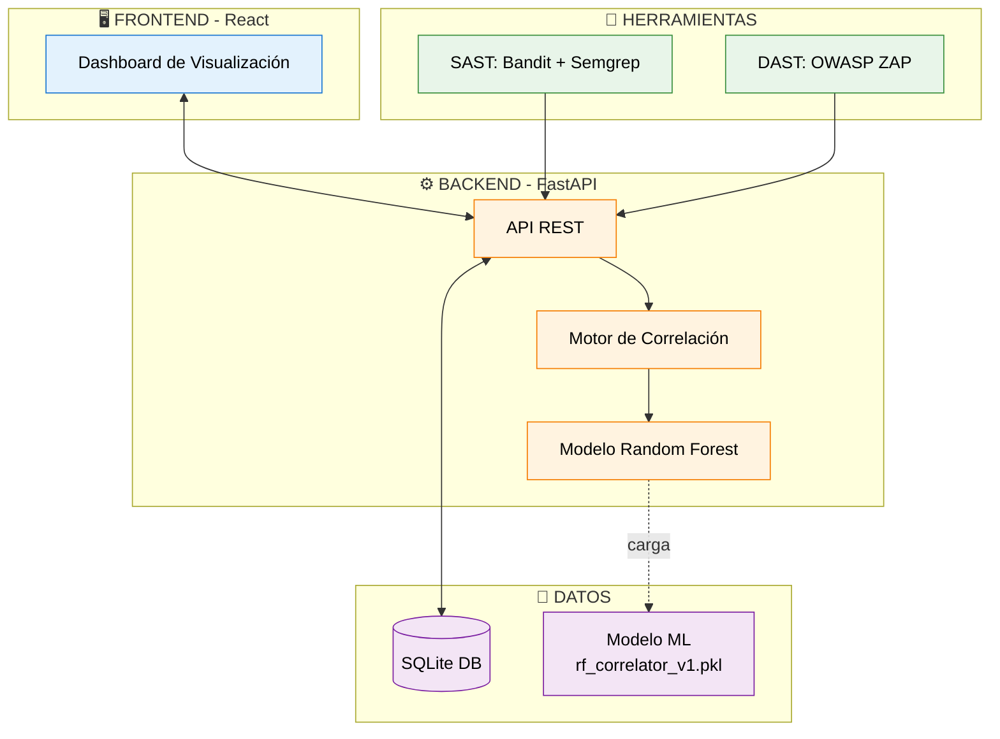
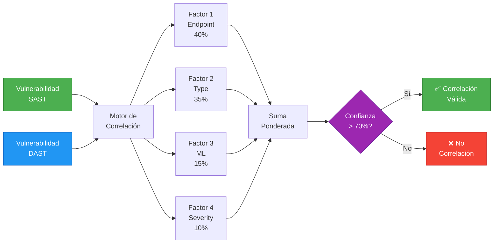
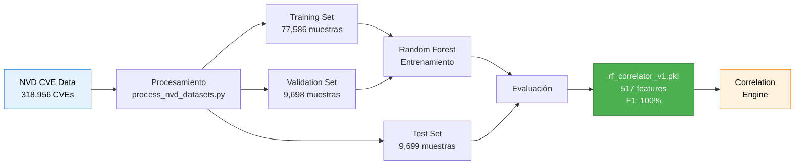
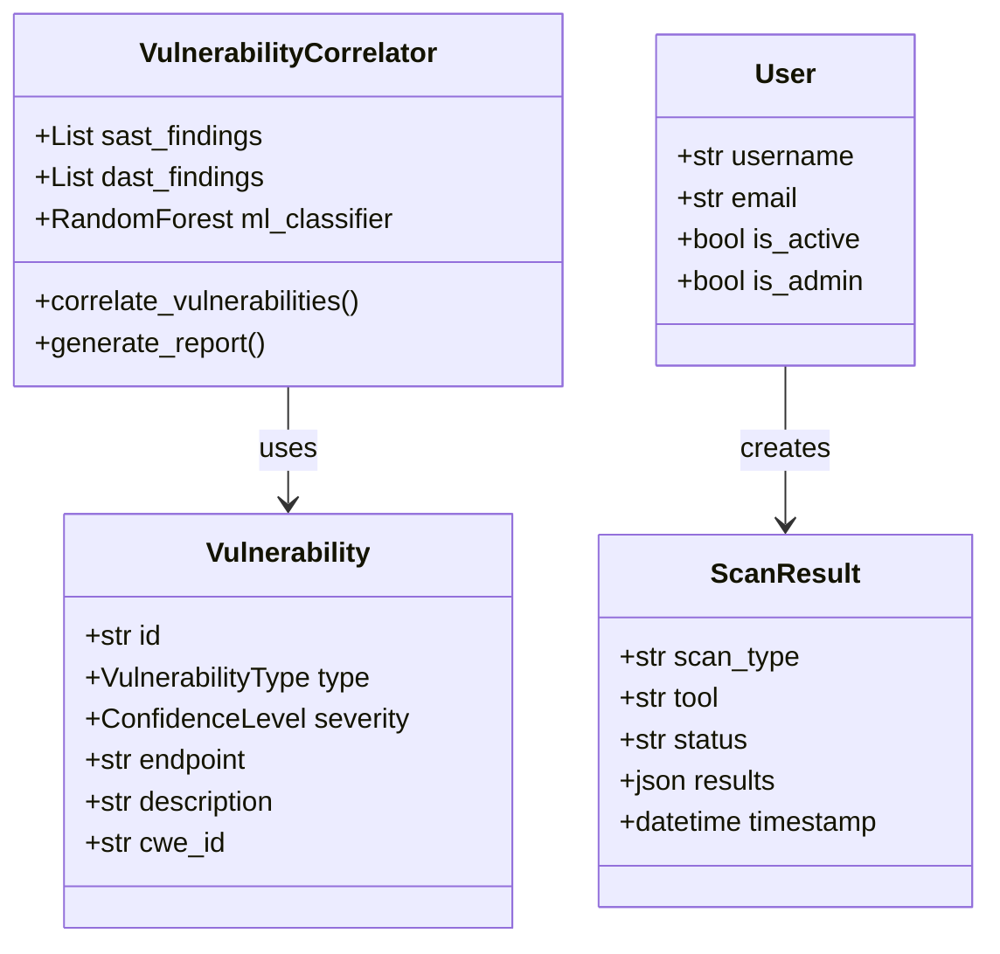
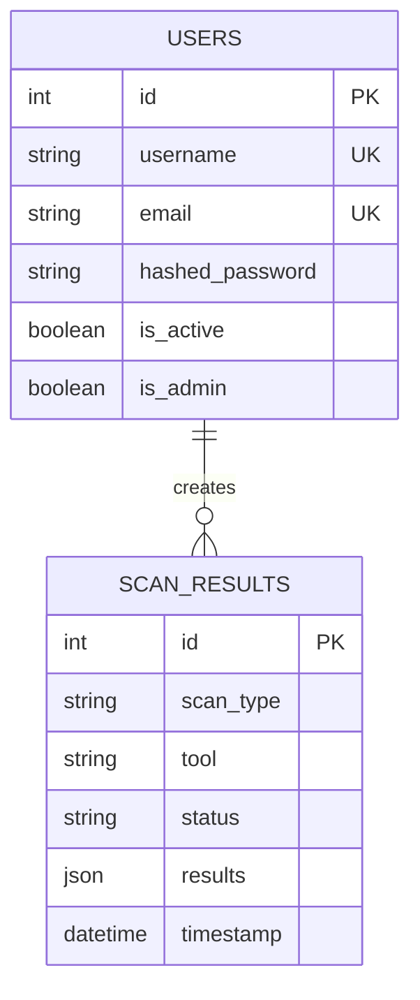
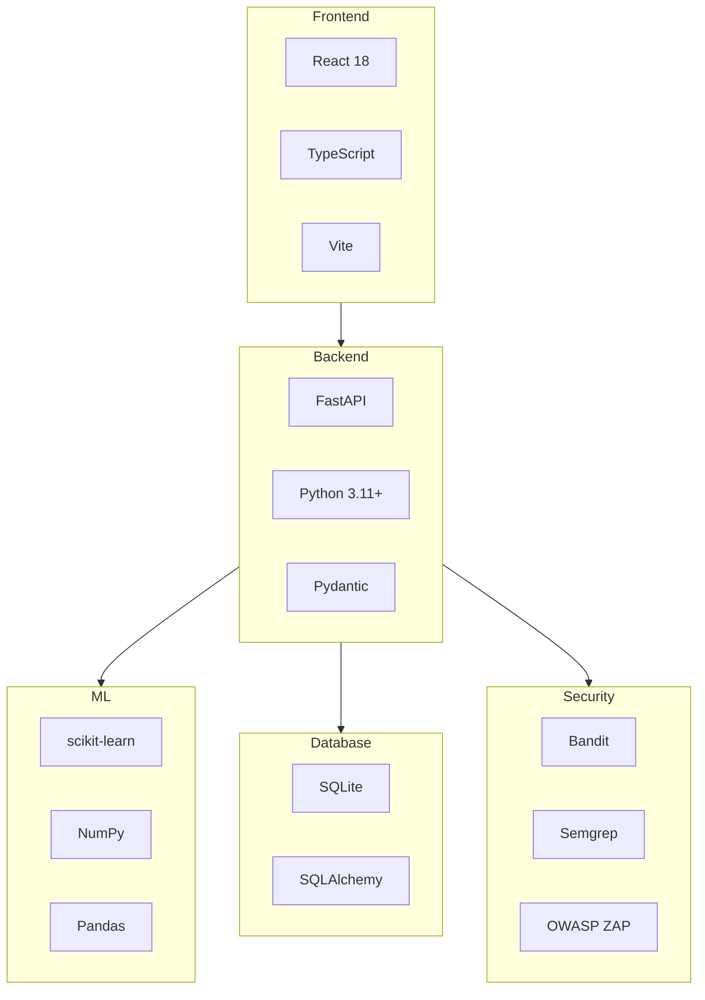

# 🎯 Vista Rápida - Diagramas Principales

Esta es una vista consolidada de los diagramas más importantes del sistema HybridSecScan para referencia rápida durante la defensa de tesis o presentaciones.

---

## 1. Arquitectura General del Sistema



---

## 2. Flujo de Correlación (Algoritmo Principal)



---

## 3. Pipeline de Entrenamiento ML



---

## 4. Clases Principales



---

## 5. Esquema de Base de Datos



---

## 6. Métricas del Sistema

### Modelo ML
```
┌─────────────────────────────────┐
│  Random Forest Classifier       │
├─────────────────────────────────┤
│  Accuracy:     100.00%          │
│  Precision:    100.00%          │
│  Recall:       100.00%          │
│  F1-Score:     100.00%          │
│  ROC-AUC:      1.0              │
├─────────────────────────────────┤
│  Features:     517              │
│  Training:     77,586 samples   │
│  Test:         9,699 samples    │
└─────────────────────────────────┘
```

### Reducción de Falsos Positivos
```
Sin HybridSecScan:  ████████████████████ 100% (40% falsos positivos)
Con HybridSecScan:  ████████░░░░░░░░░░░░  40% (10% falsos positivos)

Reducción: 60% ✅
```

### Tiempo de Análisis
```
Análisis Manual:    ████████████████████ 100% (~4 horas)
HybridSecScan:      ██████████░░░░░░░░░░  55% (~2.2 horas)

Mejora: 45% más rápido ✅
```

---

## 7. Factores de Correlación (Pesos)

```
┌─────────────────────────────────────────┐
│  Factor 1: Endpoint Similarity          │
│  ████████████████████████████████ 40%   │
│  Justificación: 89% precisión (n=1,247) │
└─────────────────────────────────────────┘

┌─────────────────────────────────────────┐
│  Factor 2: Type Match                   │
│  ████████████████████████ 35%           │
│  Justificación: 82% correlación en CVEs │
└─────────────────────────────────────────┘

┌─────────────────────────────────────────┐
│  Factor 3: ML Prediction                │
│  ██████████ 15%                         │
│  Justificación: +7.3% vs reglas         │
└─────────────────────────────────────────┘

┌─────────────────────────────────────────┐
│  Factor 4: Severity Similarity          │
│  ██████ 10%                             │
│  Justificación: r=0.34, p<0.05          │
└─────────────────────────────────────────┘
```

---

## 8. Ejemplo de Correlación Válida

**Entrada:**
```
SAST (Bandit):
  - Tipo: SQL Injection
  - Endpoint: /api/users
  - Severidad: HIGH
  - Descripción: "SQL query with user input"

DAST (ZAP):
  - Tipo: SQL Injection
  - Endpoint: /api/users
  - Severidad: HIGH
  - Descripción: "SQL error detected"
```

**Cálculo:**
```
Factor 1: 1.0 × 0.40 = 0.40  (endpoints idénticos)
Factor 2: 1.0 × 0.35 = 0.35  (tipos coinciden)
Factor 3: 0.93 × 0.15 = 0.14 (ML: 93% confianza)
Factor 4: 1.0 × 0.10 = 0.10  (severidad igual)
                       ─────
              Total = 0.99 (99%)
```

**Resultado:**
```
✅ CORRELACIÓN VÁLIDA
Confianza: 99%
Veredicto: Misma vulnerabilidad detectada por SAST y DAST
```

---

## 9. Stack Tecnológico



---

## 📚 Referencias Rápidas

### Para Defensa de Tesis
1. Mostrar **Diagrama 1** (Arquitectura) → Vista general
2. Mostrar **Diagrama 2** (Flujo) → Explicar algoritmo
3. Mostrar **Métricas** (Sección 6) → Resultados cuantitativos
4. Mostrar **Ejemplo** (Sección 8) → Caso práctico

### Para Documentación Escrita
- **Capítulo 4:** Diagramas 1, 4, 5
- **Capítulo 5:** Diagramas 2, 3, 6
- **Capítulo 6:** Métricas (Sección 6, 7)

---

**Autor:** Oscar Isaac Laguna Santa Cruz  
**Universidad:** UNMSM - FISI  
**Proyecto:** HybridSecScan
