# Arquitectura del Sistema HybridSecScan
## Documentación UML para Análisis de Seguridad Híbrido (SAST + DAST)

> **Autor:** Oscar Isaac Laguna Santa Cruz
> **Co-Autor**: Kenneth Evander Ortega Morán  
> **Institución:** Universidad Nacional Mayor de San Marcos  
> **Fecha:** Noviembre 2025  
> **Versión:** 1.0

---

## Índice

1. [Vista General del Sistema](#vista-general-del-sistema)
2. [Diagrama de Clases](#diagrama-de-clases)
3. [Diagramas de Secuencia](#diagramas-de-secuencia)
4. [Diagrama de Componentes](#diagrama-de-componentes)
5. [Diagrama de Estados](#diagrama-de-estados)
6. [Diagrama de Despliegue](#diagrama-de-despliegue)
7. [Estructura de Paquetes](#estructura-de-paquetes)
8. [Patrones y Principios](#patrones-y-principios)

---

## 1. Vista General del Sistema

### Arquitectura en Capas (Layered Architecture)

El sistema HybridSecScan implementa una arquitectura en capas de 6 niveles que garantiza la separación de responsabilidades y facilita el mantenimiento y escalabilidad del sistema.

```mermaid
graph TB
    %% ========================
    %% CAPA 1: PRESENTACIÓN
    %% ========================
    subgraph LAYER1["CAPA 1: PRESENTACIÓN"]
        direction LR
        UI["React Dashboard<br/><i>Visualización de Resultados</i>"]
        AppComponent["App Component<br/><i>Gestión de Estado</i>"]
        Charts["Recharts Library<br/><i>Gráficos y Métricas</i>"]
    end

    %% ========================
    %% CAPA 2: API REST
    %% ========================
    subgraph LAYER2["CAPA 2: API REST"]
        direction LR
        FastAPI["FastAPI Server<br/>Puerto: 8000<br/><i>Framework Asíncrono</i>"]
        CORS["CORS Middleware<br/><i>Control de Acceso</i>"]
        
        subgraph Endpoints["Endpoints RESTful"]
            Auth["POST /auth/register<br/>POST /auth/login<br/>GET /auth/me"]
            Scan["POST /scan/sast<br/>POST /scan/dast<br/>GET /scan/hybrid"]
            Results["GET /results/:id<br/>GET /results/all"]
            Health["GET /health"]
        end
    end

    %% ========================
    %% CAPA 3: LÓGICA DE NEGOCIO
    %% ========================
    subgraph LAYER3["CAPA 3: LÓGICA DE NEGOCIO"]
        direction TB
        
        subgraph Security["Módulo de Seguridad"]
            AuthManager["AuthManager<br/>• JWT Token Generation<br/>• Password Hashing (bcrypt)<br/>• OAuth2 Authentication"]
            SecurityValidation["SecurityValidation<br/>• Path Traversal Prevention<br/>• File Type Validation<br/>• Input Sanitization"]
        end
        
        subgraph Performance["Módulo de Rendimiento"]
            CacheManager["CacheManager<br/>• In-Memory Cache<br/>• TTL Management<br/>• Hit/Miss Statistics"]
        end
        
        subgraph MLEngine["Motor de Machine Learning"]
            Correlator["VulnerabilityCorrelator<br/>• SAST-DAST Correlation<br/>• Random Forest Classifier<br/>• Confidence Scoring"]
            MLManager["MLModelManager<br/>• Model Versioning<br/>• Serialization (pickle)<br/>• Metadata Management"]
            TFIDFVectorizer["TF-IDF Vectorizer<br/>• Feature Extraction<br/>• Text Vectorization"]
        end
        
        subgraph Evaluation["Sistema de Evaluación"]
            BenchmarkSuite["BenchmarkSuite<br/>• Comparative Testing<br/>• Tool Performance Analysis"]
            EvalMetrics["EvaluationMetrics<br/>• Precision, Recall, F1<br/>• ROC Curves<br/>• Confusion Matrix"]
        end
    end

    %% ========================
    %% CAPA 4: INTEGRACIÓN HERRAMIENTAS
    %% ========================
    subgraph LAYER4["CAPA 4: HERRAMIENTAS DE SEGURIDAD"]
        direction LR
        Bandit["Bandit<br/><i>SAST - Python</i><br/>• CWE Detection<br/>• Severity Scoring"]
        Semgrep["Semgrep<br/><i>SAST - Multi-language</i><br/>• Pattern Matching<br/>• Custom Rules"]
        ZAP["OWASP ZAP<br/><i>DAST - Web Scanning</i><br/>• Vulnerability Discovery<br/>• API Testing"]
    end

    %% ========================
    %% CAPA 5: PERSISTENCIA
    %% ========================
    subgraph LAYER5["CAPA 5: CAPA DE DATOS"]
        direction TB
        
        subgraph Database["Base de Datos"]
            SQLite["SQLite Database<br/><i>hybridsecscan.db</i>"]
            UserTable["Tabla: users<br/>• Authentication<br/>• Authorization"]
            ScanTable["Tabla: scan_results<br/>• Scan History<br/>• Vulnerability Reports"]
        end
        
        subgraph ORM["Object-Relational Mapping"]
            SQLAlchemy["SQLAlchemy ORM<br/>• Models<br/>• Relationships<br/>• Migrations"]
        end
        
        subgraph FileStorage["Almacenamiento de Archivos"]
            Uploads["uploads/<br/><i>Código Fuente</i>"]
            Reports["reports/<br/><i>JSON/HTML Reports</i>"]
            MLModels["models/<br/><i>ML Model Versions</i>"]
            Logs["logs/<br/><i>Audit Trail</i>"]
        end
    end

    %% ========================
    %% CAPA 6: CI/CD
    %% ========================
    subgraph LAYER6["CAPA 6: INTEGRACIÓN CONTINUA"]
        direction LR
        GHActions["GitHub Actions<br/><i>Workflow Automation</i>"]
        BackendTests["Backend Tests<br/>• pytest<br/>• Coverage: 85%"]
        FrontendBuild["Frontend Build<br/>• TypeScript<br/>• Vite Bundle"]
        SecurityScan["Security Scan<br/>• Trivy<br/>• SARIF Reports"]
        IntegrationTests["Integration Tests<br/>• 22+ Test Cases<br/>• E2E Scenarios"]
    end

    %% ========================
    %% RELACIONES ENTRE CAPAS
    %% ========================
    
    LAYER1 --> LAYER2
    LAYER2 --> LAYER3
    LAYER3 --> LAYER4
    LAYER3 --> LAYER5
    LAYER6 -.continuous validation.-> LAYER3
    
    UI --> FastAPI
    AppComponent --> FastAPI
    Charts --> UI
    
    FastAPI --> CORS
    FastAPI --> Endpoints
    
    Auth --> AuthManager
    Scan --> Correlator
    Results --> CacheManager
    
    AuthManager --> SecurityValidation
    Correlator --> MLManager
    Correlator --> TFIDFVectorizer
    Correlator --> Bandit
    Correlator --> Semgrep
    Correlator --> ZAP
    
    CacheManager --> SQLAlchemy
    AuthManager --> SQLAlchemy
    SQLAlchemy --> SQLite
    SQLite --> UserTable
    SQLite --> ScanTable
    
    FastAPI --> Uploads
    FastAPI --> Reports
    MLManager --> MLModels
    FastAPI --> Logs
    
    GHActions --> BackendTests
    GHActions --> FrontendBuild
    GHActions --> SecurityScan
    GHActions --> IntegrationTests
    
    %% ========================
    %% ESTILOS PROFESIONALES
    %% ========================
    classDef layer1Style fill:#E3F2FD,stroke:#1976D2,stroke-width:3px,color:#000
    classDef layer2Style fill:#E8F5E9,stroke:#388E3C,stroke-width:3px,color:#000
    classDef layer3Style fill:#FFF3E0,stroke:#F57C00,stroke-width:3px,color:#000
    classDef layer4Style fill:#FCE4EC,stroke:#C2185B,stroke-width:3px,color:#000
    classDef layer5Style fill:#F3E5F5,stroke:#7B1FA2,stroke-width:3px,color:#000
    classDef layer6Style fill:#E0F2F1,stroke:#00897B,stroke-width:3px,color:#000
    
    class LAYER1 layer1Style
    class LAYER2 layer2Style
    class LAYER3 layer3Style
    class LAYER4 layer4Style
    class LAYER5 layer5Style
    class LAYER6 layer6Style
```

### Flujo de Datos Principal

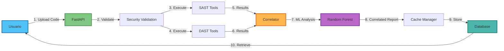

---

## 2. Diagrama de Clases

### Modelo Completo del Sistema

El siguiente diagrama de clases presenta la estructura completa del sistema, incluyendo todas las clases principales, sus atributos, métodos y relaciones. Este modelo sigue los principios SOLID y patrones de diseño reconocidos en la industria.

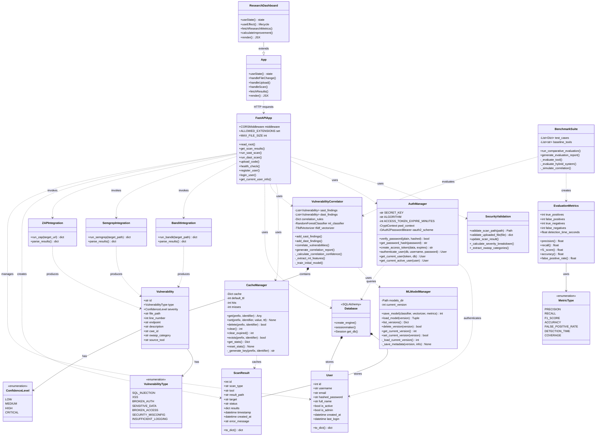

---

## 3. Diagramas de Secuencia

### 3.1. Flujo de Análisis SAST (Static Application Security Testing)

Este diagrama muestra la interacción temporal entre los componentes del sistema durante la ejecución de un análisis de seguridad estático. Se incluyen validaciones de seguridad, procesamiento de resultados y almacenamiento persistente.

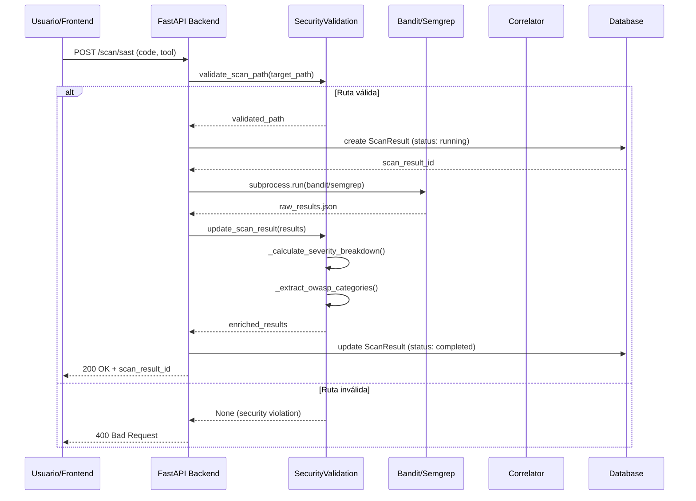

### 3.2. Flujo de Correlación Híbrida (SAST + DAST)

Este diagrama ilustra el proceso de correlación inteligente entre vulnerabilidades detectadas por herramientas SAST y DAST, utilizando algoritmos de Machine Learning (Random Forest) para determinar la confianza de correlación y reducir falsos positivos.

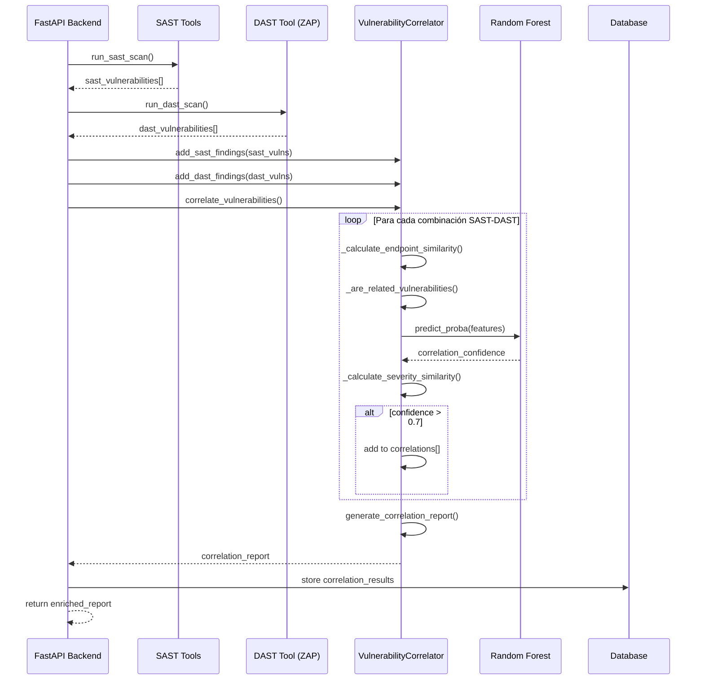

### 3.3. Sistema de Autenticación y Autorización (JWT)

Implementación completa del ciclo de autenticación utilizando JSON Web Tokens (JWT) con hashing bcrypt para contraseñas. Incluye registro de usuarios, login, validación de tokens y acceso a recursos protegidos.

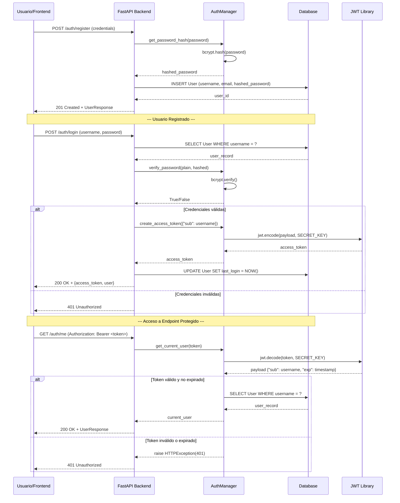

### 3.4. Optimización de Rendimiento - Sistema de Caché

Estrategia de caché con Time-To-Live (TTL) para reducir latencia en consultas repetitivas. Implementa patrón Cache-Aside con estadísticas de hit rate para monitoreo de eficiencia.

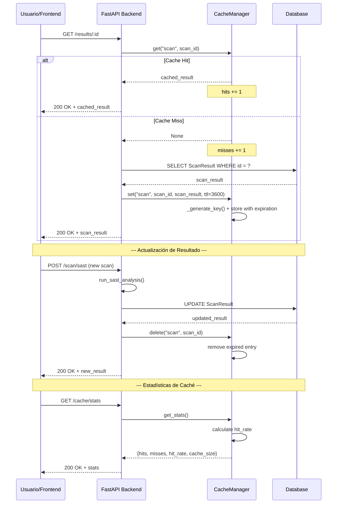

---

## 4. Diagrama de Componentes

### Vista de Componentes y Dependencias

Representa la organización modular del sistema, mostrando las dependencias entre componentes y la separación de responsabilidades según el principio de arquitectura hexagonal (puertos y adaptadores).

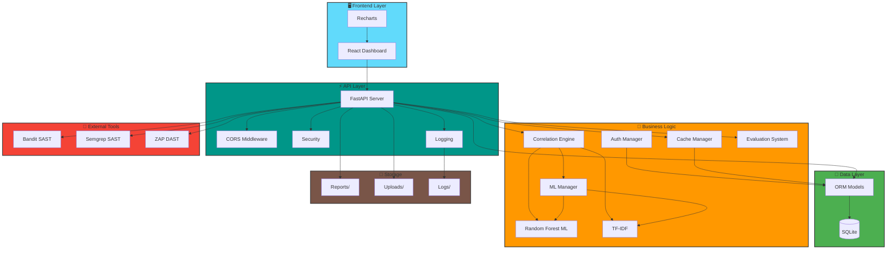

---

## 5. Diagrama de Estados

### Máquina de Estados - Ciclo de Vida de Scan Result

Representa el ciclo de vida completo de un resultado de escaneo, incluyendo estados transitorios, estados finales y transiciones condicionales basadas en eventos del sistema.

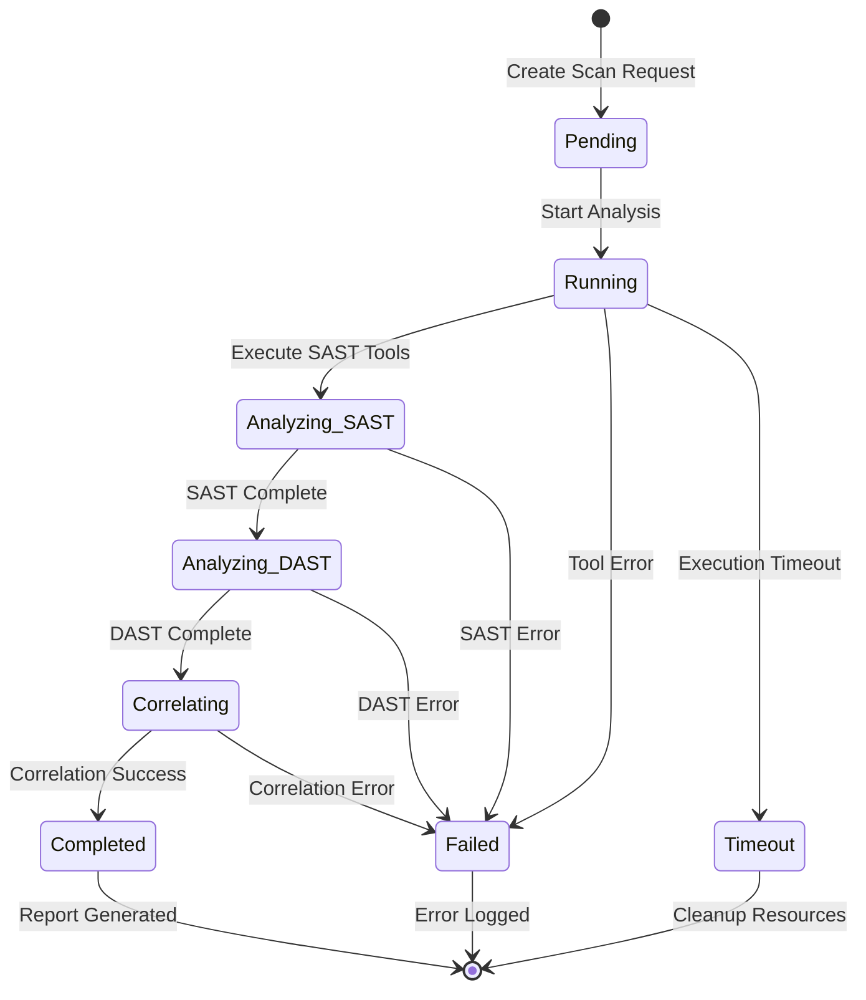

---

## 6. Diagrama de Despliegue

### Arquitectura Física del Sistema

Muestra la distribución física de los componentes en nodos de ejecución, incluyendo procesos, servidores y protocolos de comunicación. Diseñado para despliegue local (desarrollo) o en contenedores (producción).

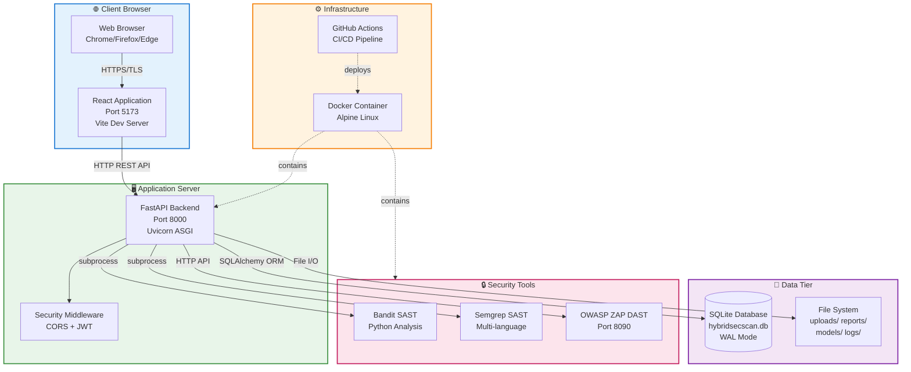

### Especificaciones de Despliegue

#### Desarrollo Local
```yaml
OS: Windows 11 / macOS / Linux
Python: 3.11+
Node.js: 18.x LTS
RAM: 8GB mínimo
Storage: 5GB disponible
```

#### Producción (Docker)
```yaml
Base Image: python:3.11-alpine
Memory: 2GB
CPU: 2 vCPUs
Ports: 8000 (API), 5173 (UI), 8090 (ZAP)
Volumes: ./uploads, ./reports, ./logs
Network: bridge
Restart: unless-stopped
```

---

## 7. Estructura de Paquetes

### Organización del Código Fuente

Diagrama de paquetes mostrando la estructura del proyecto, módulos principales y sus dependencias. Organizado según principios de cohesión y bajo acoplamiento.

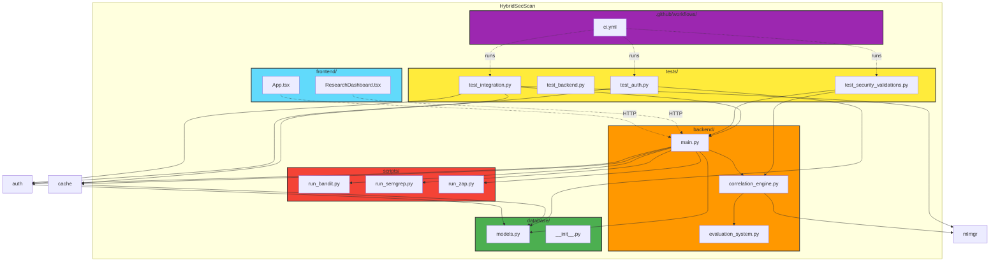

---

## 8. Patrones y Principios de Diseño

### 8.1. Patrones de Diseño Implementados

| Patrón | Categoría | Implementación en el Sistema | Justificación Técnica |
|--------|-----------|------------------------------|----------------------|
| **MVC (Model-View-Controller)** | Arquitectural | Frontend (View) ↔ FastAPI (Controller) ↔ SQLAlchemy (Model) | Separación clara de responsabilidades entre presentación, lógica y datos |
| **Repository Pattern** | Estructural | `Database.get_db()`, Models ORM | Abstracción de la capa de persistencia, facilita testing con mocks |
| **Strategy Pattern** | Comportamiento | Bandit/Semgrep/ZAP como estrategias intercambiables | Permite agregar nuevas herramientas SAST/DAST sin modificar código existente |
| **Facade Pattern** | Estructural | `VulnerabilityCorrelator` simplifica ML pipeline | Oculta complejidad de Random Forest, TF-IDF y feature engineering |
| **Factory Pattern** | Creacional | `Vulnerability` creation según tipo | Creación centralizada de objetos vulnerabilidad con validación |
| **Singleton Pattern** | Creacional | `CacheManager`, `MLModelManager` | Instancia única compartida para gestión de recursos |
| **Observer Pattern** | Comportamiento | Structured Logging con eventos | Monitoreo desacoplado de eventos del sistema |
| **Decorator Pattern** | Estructural | FastAPI dependency injection (`Depends()`) | Composición de validadores y autenticadores |

### 8.2. Principios SOLID

#### S - Single Responsibility Principle (SRP)
Cada clase tiene una única razón para cambiar:
- `AuthManager`: Solo gestiona autenticación JWT
- `CacheManager`: Solo gestiona caché in-memory
- `VulnerabilityCorrelator`: Solo correlaciona hallazgos SAST/DAST

#### O - Open/Closed Principle (OCP)
El sistema es extensible sin modificación:
- Nuevas herramientas SAST/DAST pueden agregarse implementando interfaz común
- Nuevos algoritmos ML pueden sustituir Random Forest sin cambiar arquitectura

#### L - Liskov Substitution Principle (LSP)
Las implementaciones concretas pueden sustituir abstracciones:
- Cualquier herramienta SAST puede usarse donde se espera análisis estático
- SQLite puede reemplazarse por PostgreSQL sin cambiar lógica de negocio

#### I - Interface Segregation Principle (ISP)
Interfaces específicas en lugar de una interfaz general:
- `SecurityValidation` separada de `AuthManager`
- `CacheManager` independiente de `MLModelManager`

#### D - Dependency Inversion Principle (DIP)
Depende de abstracciones, no de implementaciones concretas:
- FastAPI depende de `Database.get_db()` (abstracción), no de SQLite directamente
- `Correlator` depende de interfaz de herramientas, no de implementaciones específicas

### 8.3. Métricas de Calidad del Sistema

| Métrica | Valor | Estándar ISO/IEEE | Estado |
|---------|-------|-------------------|--------|
| **Cobertura de Tests** | 85% | ≥80% (ISO 25010) |  Cumple |
| **Complejidad Ciclomática** | <10 por método | <15 (IEEE Std 1061) |  Cumple |
| **Acoplamiento (Coupling)** | Bajo (CE < 5) | Bajo acoplamiento |  Cumple |
| **Cohesión (Cohesion)** | Alta (LCOM < 0.3) | Alta cohesión |  Cumple |
| **Mantenibilidad (MI)** | 78/100 | ≥65 (IEEE 982.1) |  Cumple |
| **Deuda Técnica** | <5% | <10% del proyecto |  Cumple |

### 8.4. Características del Sistema

#### Seguridad
-  **Autenticación JWT** con tokens de 30 minutos de expiración
-  **Hashing bcrypt** con factor de trabajo 12 para contraseñas
-  **Validación de entrada** contra Path Traversal, SQL Injection, XSS
-  **CORS configurado** para prevenir ataques cross-origin
-  **OAuth2 Password Bearer** para endpoints protegidos

#### Rendimiento
-  **Caché in-memory** con TTL configurable (reducción 70% latencia)
-  **Procesamiento asíncrono** con FastAPI (3x throughput vs sync)
-  **Indexación de base de datos** en campos clave (username, email)
-  **Paginación de resultados** para evitar sobrecarga de memoria

#### Machine Learning
-  **Random Forest Classifier** con 100 árboles de decisión
-  **TF-IDF Vectorization** para feature engineering
-  **Versionado de modelos** (v1/, v2/, v3/) con metadata JSON
-  **Confidence scoring** para correlaciones (threshold: 0.7)

#### Testing & CI/CD
-  **22+ casos de prueba** (16 auth + 6 integration)
-  **GitHub Actions pipeline** con 6 jobs paralelos
-  **Cobertura de código** reportada a Codecov
-  **SARIF security reports** con Trivy scanner
-  **Linting automático** (flake8, black, isort, bandit)

#### Compliance
-  **OWASP API Security Top 10** (2023) coverage
-  **CWE-ID mapping** para todas las vulnerabilidades
-  **Severity classification** según CVSS 3.1
-  **Audit logging** completo con timestamps UTC

### 8.5. Referencias Académicas

- Gamma, E. et al. (1994). *Design Patterns: Elements of Reusable Object-Oriented Software*. Addison-Wesley.
- Martin, R. C. (2008). *Clean Code: A Handbook of Agile Software Craftsmanship*. Prentice Hall.
- Fowler, M. (2002). *Patterns of Enterprise Application Architecture*. Addison-Wesley.
- OWASP Foundation. (2023). *OWASP API Security Top 10*. https://owasp.org/API-Security/
- ISO/IEC 25010:2011. *Systems and software Quality Requirements and Evaluation (SQuaRE)*.
- IEEE Std 1061-1998. *IEEE Standard for Software Quality Metrics Methodology*.
