# Pipeline de Entrenamiento del Modelo ML
## Documentación UML para el Sistema de Machine Learning

> **Autor:** Oscar Isaac Laguna Santa Cruz 
> **Co-Autor**: Kenneth Evander Ortega Morán  
> **Institución:** Universidad Nacional Mayor de San Marcos  
> **Fecha:** Noviembre 2025  
> **Versión:** 1.0

---

## Índice

1. [Vista General del Pipeline](#1-vista-general-del-pipeline)
2. [Diagrama de Flujo del Entrenamiento](#2-diagrama-de-flujo-del-entrenamiento)
3. [Descripción Detallada del Pipeline](#3-descripción-detallada-del-pipeline)
4. [Diagrama de Secuencia](#4-diagrama-de-secuencia-del-entrenamiento)
5. [Diagrama de Clases](#5-diagrama-de-clases-del-pipeline-ml)
6. [Métricas de Evaluación](#6-métricas-de-evaluación-del-modelo)
7. [Consideraciones para Tesis](#7-consideraciones-para-tesis)
8. [Ejemplo de Uso](#8-ejemplo-de-uso-del-modelo-entrenado)

---

## 1. Vista General del Pipeline

El sistema HybridSecScan implementa un pipeline de Machine Learning para entrenar el modelo de correlación de vulnerabilidades SAST-DAST. Este pipeline procesa datos reales de NVD (National Vulnerability Database) y genera un clasificador Random Forest con métricas de alta precisión.

### Datos Procesados
- **318,956 CVEs** de NVD (2002-2025)
- **96,983 registros** de correlación SAST-DAST
- **517 features** (TF-IDF + categóricas + numéricas)
- **Split 80/10/10** (Training/Validation/Test)

### Modelo Resultante
- **Algoritmo:** Random Forest (200 árboles)
- **Accuracy:** 100%
- **F1-Score:** 100%
- **ROC-AUC:** 1.0000

---

## 2. Diagrama de Flujo del Entrenamiento

```mermaid
flowchart TB
    Start([Inicio Pipeline ML])
    
    %% ======================
    %% FASE 1: DESCARGA DATOS
    %% ======================
    subgraph Phase1["FASE 1: ADQUISICIÓN DE DATOS"]
        Download[ Descargar CVEs desde NVD<br/>Archivos JSON 2002-2025<br/>Total: 24 archivos]
        ValidateJSON{ ¿Archivos<br/>válidos?}
        ErrorDownload[ Error de Descarga<br/>Reintentar o usar backup]
    end
    
    %% ======================
    %% FASE 2: PROCESAMIENTO
    %% ======================
    subgraph Phase2["FASE 2: PROCESAMIENTO DE DATOS"]
        LoadJSON[ Cargar JSON Files<br/>data/raw/nvd/*.json]
        ParseCVE[ Parsear CVE Items<br/>Extraer: ID, CWE, Severidad,<br/>Descripción, Referencias]
        
        subgraph ExtractFeatures["Extracción de Características"]
            ExtractCWE[Extraer CWE-IDs<br/>Ej: CWE-89, CWE-79]
            ExtractSeverity[Extraer CVSS Score<br/>Critical/High/Medium/Low]
            ExtractDesc[Extraer Descripción<br/>Texto en inglés]
            NormalizeSeverity[Normalizar Severidad<br/>CRITICAL → HIGH<br/>NONE → INFO]
        end
        
        GenerateCorrelations[ Generar Correlaciones<br/>SAST-DAST Sintéticas<br/>Basadas en CWE patterns]
        
        subgraph CorrelationLogic["Lógica de Correlación"]
            CheckSAST{¿CWE detectable<br/>por SAST?}
            CheckDAST{¿CWE detectable<br/>por DAST?}
            AssignLabel[Asignar Label<br/>is_correlated: 1 o 0]
            CalcConfidence[Calcular Confidence<br/>Score: 0.0-1.0]
        end
        
        CreateDataFrame[ Crear DataFrame<br/>Pandas con 18 columnas]
        
        ValidateData{ ¿Datos<br/>consistentes?}
        ErrorProcess[ Error de Procesamiento<br/>Revisar formato JSON]
    end
    
    %% ======================
    %% FASE 3: SPLIT DATASET
    %% ======================
    subgraph Phase3["FASE 3: DIVISIÓN DE DATOS"]
        ShuffleData[ Shuffle Dataset<br/>random_state=42]
        SplitData[ Split 80/10/10<br/>Train/Val/Test]
        
        subgraph Splits["Conjuntos Resultantes"]
            TrainSet[ Training Set<br/>77,586 muestras 80%]
            ValSet[ Validation Set<br/>9,698 muestras 10%]
            TestSet[ Test Set<br/>9,699 muestras 10%]
        end
        
        SaveCSV[ Guardar CSV<br/>data/processed/]
        
        ValidateSplit{ ¿Split<br/>balanceado?}
    end
    
    %% ======================
    %% FASE 4: FEATURE ENGINEERING
    %% ======================
    subgraph Phase4["FASE 4: INGENIERÍA DE FEATURES"]
        LoadCSV[ Cargar CSVs<br/>Training/Validation/Test]
        
        subgraph TextFeatures["Features Textuales"]
            CombineText[Combinar Descripciones<br/>SAST + DAST]
            TFIDF[TF-IDF Vectorization<br/>max_features=500<br/>ngram_range=1,2]
            FitTFIDF{¿Fit o<br/>Transform?}
            FitVectorizer[Fit en Training<br/>Crear vocabulario]
            TransformVectorizer[Transform en Val/Test<br/>Usar vocabulario existente]
        end
        
        subgraph CategoricalFeatures["Features Categóricas"]
            EncodeCat[Label Encoding<br/>8 columnas categóricas]
            TypeEncode[Encode sast_type<br/>dast_type]
            SeverityEncode[Encode sast_severity<br/>dast_severity]
            CWEEncode[Encode sast_cwe<br/>dast_cwe]
            ToolEncode[Encode sast_tool<br/>dast_tool]
        end
        
        subgraph NumericFeatures["Features Numéricas"]
            TypeMatch[Type Match 0/1]
            CWEMatch[CWE Match 0/1]
            SevMatch[Severity Match 0/1]
            DescLength[Description Length]
            FileDepth[File/Endpoint Depth]
            LineNumber[SAST Line Number]
        end
        
        ConcatFeatures[🔗 Concatenar Features<br/>TF-IDF + Categorical + Numeric<br/>Total: 517 features]
        
        ValidateFeatures{ ¿Todas las<br/>features válidas?}
        ErrorFeatures[ Error en Features<br/>Revisar NaN/Inf]
    end
    
    %% ======================
    %% FASE 5: ENTRENAMIENTO
    %% ======================
    subgraph Phase5["FASE 5: ENTRENAMIENTO DEL MODELO"]
        InitRF[ Inicializar Random Forest<br/>n_estimators=200<br/>max_depth=20<br/>class_weight=balanced]
        
        FitModel[ Entrenar Modelo<br/>X_train, y_train<br/>n_jobs=-1 paralelo]
        
        subgraph Training["Proceso de Entrenamiento"]
            BuildTrees[Construir 200 Árboles<br/>Bootstrap sampling]
            SelectFeatures[Feature Selection<br/>sqrt features por split]
            GrowTree[Crecer Árboles<br/>hasta max_depth=20]
            PruneTree[Pruning<br/>min_samples_leaf=5]
        end
        
        ModelTrained[ Modelo Entrenado<br/>200 árboles completos]
    end
    
    %% ======================
    %% FASE 6: EVALUACIÓN
    %% ======================
    subgraph Phase6["FASE 6: EVALUACIÓN Y VALIDACIÓN"]
        PredictVal[ Predicción Validation<br/>y_val_pred]
        PredictTest[ Predicción Test<br/>y_test_pred]
        
        subgraph Metrics["Cálculo de Métricas"]
            CalcAccuracy[Accuracy Score]
            CalcPrecision[Precision Score]
            CalcRecall[Recall Score]
            CalcF1[F1-Score]
            CalcROCAUC[ROC-AUC Score]
            ConfMatrix[Confusion Matrix<br/>TP/TN/FP/FN]
        end
        
        ValidateMetrics{ Métricas<br/>aceptables?<br/>F1 > 0.85}
        
        AcceptModel[ Modelo Aceptado<br/>F1=1.00, AUC=1.00]
        RejectModel[ Modelo Rechazado<br/>Ajustar hiperparámetros]
        
        FeatureImportance[ Feature Importance<br/>Top 15 features más importantes]
        GenerateReport[ Generar Reporte<br/>Classification Report]
    end
    
    %% ======================
    %% FASE 7: PERSISTENCIA
    %% ======================
    subgraph Phase7["FASE 7: GUARDADO DEL MODELO"]
        PackageModel[ Empaquetar Modelo<br/>classifier + vectorizer<br/>+ encoders + metadata]
        
        SaveModel[ Guardar PKL<br/>rf_correlator_v1.pkl<br/>usando joblib]
        
        SaveMetadata[ Guardar Metadata<br/>metadata.json<br/>métricas + info]
        
        ValidateSave{ ¿Guardado<br/>exitoso?}
        ErrorSave[ Error al Guardar<br/>Verificar permisos]
    end
    
    %% ======================
    %% FIN
    %% ======================
    End([🏁 Pipeline Completado<br/>Modelo Listo para Producción])
    
    %% ================================
    %% FLUJO PRINCIPAL
    %% ================================
    Start --> Download
    Download --> ValidateJSON
    ValidateJSON -->|Sí| LoadJSON
    ValidateJSON -->|No| ErrorDownload
    ErrorDownload --> Download
    
    LoadJSON --> ParseCVE
    ParseCVE --> ExtractCWE
    ExtractCWE --> ExtractSeverity
    ExtractSeverity --> ExtractDesc
    ExtractDesc --> NormalizeSeverity
    NormalizeSeverity --> GenerateCorrelations
    
    GenerateCorrelations --> CheckSAST
    CheckSAST -->|Sí| CheckDAST
    CheckSAST -->|No| CheckDAST
    CheckDAST --> AssignLabel
    AssignLabel --> CalcConfidence
    CalcConfidence --> CreateDataFrame
    
    CreateDataFrame --> ValidateData
    ValidateData -->|Sí| ShuffleData
    ValidateData -->|No| ErrorProcess
    ErrorProcess --> ParseCVE
    
    ShuffleData --> SplitData
    SplitData --> TrainSet
    SplitData --> ValSet
    SplitData --> TestSet
    TrainSet & ValSet & TestSet --> SaveCSV
    
    SaveCSV --> ValidateSplit
    ValidateSplit -->|Sí| LoadCSV
    ValidateSplit -->|No| ShuffleData
    
    LoadCSV --> CombineText
    CombineText --> TFIDF
    TFIDF --> FitTFIDF
    FitTFIDF -->|Fit Training| FitVectorizer
    FitTFIDF -->|Transform Val/Test| TransformVectorizer
    FitVectorizer --> EncodeCat
    TransformVectorizer --> EncodeCat
    
    EncodeCat --> TypeEncode
    TypeEncode --> SeverityEncode
    SeverityEncode --> CWEEncode
    CWEEncode --> ToolEncode
    ToolEncode --> TypeMatch
    
    TypeMatch --> CWEMatch
    CWEMatch --> SevMatch
    SevMatch --> DescLength
    DescLength --> FileDepth
    FileDepth --> LineNumber
    LineNumber --> ConcatFeatures
    
    ConcatFeatures --> ValidateFeatures
    ValidateFeatures -->|Sí| InitRF
    ValidateFeatures -->|No| ErrorFeatures
    ErrorFeatures --> CombineText
    
    InitRF --> FitModel
    FitModel --> BuildTrees
    BuildTrees --> SelectFeatures
    SelectFeatures --> GrowTree
    GrowTree --> PruneTree
    PruneTree --> ModelTrained
    
    ModelTrained --> PredictVal
    PredictVal --> PredictTest
    PredictTest --> CalcAccuracy
    CalcAccuracy --> CalcPrecision
    CalcPrecision --> CalcRecall
    CalcRecall --> CalcF1
    CalcF1 --> CalcROCAUC
    CalcROCAUC --> ConfMatrix
    
    ConfMatrix --> ValidateMetrics
    ValidateMetrics -->|Sí| AcceptModel
    ValidateMetrics -->|No| RejectModel
    RejectModel --> InitRF
    
    AcceptModel --> FeatureImportance
    FeatureImportance --> GenerateReport
    GenerateReport --> PackageModel
    
    PackageModel --> SaveModel
    SaveModel --> SaveMetadata
    SaveMetadata --> ValidateSave
    ValidateSave -->|Sí| End
    ValidateSave -->|No| ErrorSave
    ErrorSave --> SaveModel
    
    %% ================================
    %% ESTILOS
    %% ================================
    classDef phaseStyle fill:#e3f2fd,stroke:#1976d2,stroke-width:3px
    classDef processStyle fill:#fff3e0,stroke:#f57c00,stroke-width:2px
    classDef decisionStyle fill:#f3e5f5,stroke:#7b1fa2,stroke-width:2px
    classDef errorStyle fill:#ffebee,stroke:#c62828,stroke-width:2px
    classDef successStyle fill:#e8f5e9,stroke:#2e7d32,stroke-width:2px
    classDef dataStyle fill:#e0f2f1,stroke:#00695c,stroke-width:2px
    
    class Phase1,Phase2,Phase3,Phase4,Phase5,Phase6,Phase7 phaseStyle
    class Download,ParseCVE,GenerateCorrelations,CreateDataFrame,ShuffleData,SplitData,LoadCSV,CombineText,TFIDF,EncodeCat,ConcatFeatures,InitRF,FitModel,PredictVal,PredictTest,PackageModel,SaveModel,SaveMetadata processStyle
    class ValidateJSON,ValidateData,ValidateSplit,FitTFIDF,ValidateFeatures,ValidateMetrics,CheckSAST,CheckDAST,ValidateSave decisionStyle
    class ErrorDownload,ErrorProcess,ErrorFeatures,ErrorSave,RejectModel errorStyle
    class AcceptModel,ModelTrained,End successStyle
    class TrainSet,ValSet,TestSet,SaveCSV dataStyle
```



---

## 3. Descripción Detallada del Pipeline

### FASE 1: Adquisición de Datos
- **Fuente:** National Vulnerability Database (NVD)
- **Formato:** JSON files (API v2.0)
- **Período:** 2002-2025 (24 archivos)
- **Total CVEs:** 318,956 vulnerabilidades

### FASE 2: Procesamiento de Datos
**Extracción de Características:**
- CVE ID (ej: CVE-2023-12345)
- CWE-IDs (ej: CWE-89 SQL Injection)
- CVSS Score y Severidad (Critical/High/Medium/Low)
- Descripción en inglés (limitada a 500 caracteres)

**Generación de Correlaciones:**
- Se simula detección SAST/DAST basada en patrones CWE
- CWEs detectables por SAST: CWE-89, CWE-79, CWE-78, CWE-22, etc.
- CWEs detectables por DAST: CWE-89, CWE-79, CWE-352, CWE-434, etc.
- Label `is_correlated=1` si ambos detectan la misma vulnerabilidad

**Resultado:** 96,983 registros de correlación

### FASE 3: División de Datos
```
Training Set:   77,586 muestras (80.0%)
Validation Set:  9,698 muestras (10.0%)
Test Set:        9,699 muestras (10.0%)
```

**Estrategia:**
- Shuffle con `random_state=42` para reproducibilidad
- Split estratificado manteniendo balance de clases
- Distribución: 60.2% correlacionadas, 39.8% no correlacionadas

### FASE 4: Ingeniería de Features

**1. Features Textuales (TF-IDF):**
- Vectorización de descripciones SAST + DAST
- 500 features TF-IDF
- N-gramas: unigrams + bigrams
- Stop words: inglés

**2. Features Categóricas (Label Encoding):**
- sast_type, dast_type
- sast_severity, dast_severity
- sast_cwe, dast_cwe
- sast_tool, dast_tool

**3. Features Numéricas:**
- Type Match (binario)
- CWE Match (binario)
- Severity Match (binario)
- Longitud de descripciones
- Profundidad de archivos/endpoints
- Número de línea (SAST)

**Total:** 517 features

### FASE 5: Entrenamiento del Modelo

**Algoritmo:** Random Forest Classifier

**Hiperparámetros:**
```python
n_estimators=200          # Número de árboles
max_depth=20              # Profundidad máxima
min_samples_split=10      # Mínimo para split
min_samples_leaf=5        # Mínimo en hoja
max_features='sqrt'       # Features por split
class_weight='balanced'   # Balanceo de clases
random_state=42           # Reproducibilidad
n_jobs=-1                 # Paralelización
```

**Justificación del Algoritmo:**
- **Interpretabilidad:** Feature importance analysis
- **Robustez:** Maneja datos mixtos (texto + categóricos + numéricos)
- **Ensemble:** Reduce overfitting mediante bagging
- **Escalabilidad:** Paralelizable en múltiples cores

### FASE 6: Evaluación y Validación

**Métricas en Test Set:**
```
Accuracy:  100.0%
Precision: 100.0%
Recall:    100.0%
F1-Score:  100.0%
ROC-AUC:   1.0000
```

**Matriz de Confusión:**
```
              Predicho No    Predicho Sí
Real No           3,923            0
Real Sí               0        5,776
```

**Top 5 Features Más Importantes:**
1. Type Match (tipo_coincide)
2. CWE Match (cwe_coincide)
3. TF-IDF features de descripciones
4. Severity similarity
5. Tool compatibility

### FASE 7: Persistencia del Modelo

**Archivos Generados:**

1. **rf_correlator_v1.pkl** (70 MB)
   - Random Forest classifier
   - TF-IDF vectorizer
   - Label encoders
   - Metadata del modelo

2. **metadata.json**
```json
{
  "validation": {
    "accuracy": 1.0,
    "precision": 1.0,
    "recall": 1.0,
    "f1_score": 1.0,
    "roc_auc": 1.0
  },
  "test": {
    "accuracy": 1.0,
    "precision": 1.0,
    "recall": 1.0,
    "f1_score": 1.0,
    "roc_auc": 1.0
  },
  "training_info": {
    "n_train_samples": 77586,
    "n_val_samples": 9698,
    "n_test_samples": 9699,
    "n_features": 517
  }
}
```

---

## 4. Diagrama de Secuencia del Entrenamiento

```mermaid
sequenceDiagram
    participant User as 👤 Usuario
    participant Script as 🐍 train_ml_model.py
    participant Processor as 📊 CorrelationMLTrainer
    participant FS as 💾 FileSystem
    participant SKLearn as 🤖 scikit-learn
    
    User->>Script: python backend/train_ml_model.py
    activate Script
    
    Script->>Processor: __init__()
    activate Processor
    Processor-->>Script: trainer instance
    
    Script->>Processor: load_datasets()
    Processor->>FS: read training_set.csv
    FS-->>Processor: 77,586 rows
    Processor->>FS: read validation_set.csv
    FS-->>Processor: 9,698 rows
    Processor->>FS: read test_set.csv
    FS-->>Processor: 9,699 rows
    Processor-->>Script: datasets loaded
    
    Script->>Processor: train_model()
    
    Note over Processor: FASE: Feature Engineering
    Processor->>Processor: engineer_features(train_df, fit=True)
    Processor->>SKLearn: TfidfVectorizer.fit_transform()
    SKLearn-->>Processor: TF-IDF matrix (500 features)
    Processor->>SKLearn: LabelEncoder.fit_transform()
    SKLearn-->>Processor: encoded categories
    Processor->>Processor: compute numeric features
    Processor->>Processor: concatenate all features
    Processor-->>Processor: X_train (77,586 × 517)
    
    Processor->>Processor: engineer_features(val_df, fit=False)
    Processor-->>Processor: X_val (9,698 × 517)
    
    Processor->>Processor: engineer_features(test_df, fit=False)
    Processor-->>Processor: X_test (9,699 × 517)
    
    Note over Processor,SKLearn: FASE: Entrenamiento
    Processor->>SKLearn: RandomForestClassifier()
    SKLearn-->>Processor: rf_classifier instance
    
    Processor->>SKLearn: fit(X_train, y_train)
    Note right of SKLearn: Construyendo 200 árboles<br/>en paralelo (n_jobs=-1)
    SKLearn-->>Processor: model trained
    
    Script->>Processor: evaluate_model()
    
    Note over Processor,SKLearn: FASE: Evaluación
    Processor->>SKLearn: predict(X_val)
    SKLearn-->>Processor: y_val_pred
    Processor->>SKLearn: predict_proba(X_val)
    SKLearn-->>Processor: y_val_proba
    
    Processor->>SKLearn: predict(X_test)
    SKLearn-->>Processor: y_test_pred
    Processor->>SKLearn: predict_proba(X_test)
    SKLearn-->>Processor: y_test_proba
    
    Processor->>SKLearn: accuracy_score()
    SKLearn-->>Processor: 1.0
    Processor->>SKLearn: precision_recall_fscore_support()
    SKLearn-->>Processor: P=1.0, R=1.0, F1=1.0
    Processor->>SKLearn: roc_auc_score()
    SKLearn-->>Processor: AUC=1.0
    Processor->>SKLearn: confusion_matrix()
    SKLearn-->>Processor: [[3923, 0], [0, 5776]]
    
    Processor-->>Script: metrics computed
    
    Script->>Processor: save_model()
    
    Note over Processor,FS: FASE: Persistencia
    Processor->>Processor: package_model()
    Processor->>FS: joblib.dump(model, rf_correlator_v1.pkl)
    FS-->>Processor: saved (70 MB)
    Processor->>FS: json.dump(metadata, metadata.json)
    FS-->>Processor: saved
    
    Processor-->>Script: model saved
    deactivate Processor
    
    Script-->>User: ✅ ENTRENAMIENTO COMPLETADO<br/>F1-Score: 100%
    deactivate Script
```



---

## 5. Diagrama de Clases del Pipeline ML


---

## 6. Métricas de Evaluación del Modelo

### Tabla de Métricas

| Métrica | Validation Set | Test Set | Interpretación |
|---------|---------------|----------|----------------|
| **Accuracy** | 100.0% | 100.0% | Proporción de predicciones correctas |
| **Precision** | 100.0% | 100.0% | De las predichas como correlacionadas, cuántas lo son realmente |
| **Recall** | 100.0% | 100.0% | De las realmente correlacionadas, cuántas se detectan |
| **F1-Score** | 100.0% | 100.0% | Media armónica de Precision y Recall |
| **ROC-AUC** | 1.0000 | 1.0000 | Área bajo la curva ROC (capacidad discriminativa) |

### Matriz de Confusión (Test Set)

|                | Predicho: No Correlacionadas | Predicho: Correlacionadas |
|----------------|----------------------------|--------------------------|
| **Real: No Correlacionadas** | **TN = 3,923** | FP = 0 |
| **Real: Correlacionadas** | FN = 0 | **TP = 5,776** |

**Interpretación:**
- **True Negatives (TN):** 3,923 casos correctamente identificados como no correlacionados
- **True Positives (TP):** 5,776 casos correctamente identificados como correlacionados
- **False Positives (FP):** 0 casos (no hay falsos positivos)
- **False Negatives (FN):** 0 casos (no hay falsos negativos)

### Distribución de Clases

```
Training Set (77,586 muestras):
  ├─ Correlacionadas:     46,686 (60.2%)
  └─ No Correlacionadas:  30,900 (39.8%)

Validation Set (9,698 muestras):
  ├─ Correlacionadas:     5,843 (60.2%)
  └─ No Correlacionadas:  3,855 (39.8%)

Test Set (9,699 muestras):
  ├─ Correlacionadas:     5,776 (59.5%)
  └─ No Correlacionadas:  3,923 (40.5%)
```

---

## 7. Consideraciones para Tesis

### Validez Académica del Modelo

**Fortalezas:**
1. **Dataset Robusto:** 318,956 CVEs de fuente oficial (NVD)
2. **Muestra Grande:** 96,983 registros de correlación
3. **Features Diversas:** 517 características (texto + categóricas + numéricas)
4. **Split Estratificado:** 80/10/10 con balance de clases
5. **Reproducibilidad:** `random_state=42` en todos los procesos

**Limitaciones a Mencionar:**
1. **Datos Sintéticos:** Las correlaciones fueron generadas con reglas determinísticas, no provienen de ejecuciones reales de herramientas SAST/DAST
2. **Métricas Perfectas:** 100% accuracy sugiere que el problema es demasiado simple con los datos sintéticos
3. **Sesgo de Generación:** El modelo aprende los mismos patrones con los que se generaron los datos

**Recomendación para la Tesis:**
- Presentar este modelo como **prueba de concepto (PoC)** del pipeline
- Mencionar que en producción se requeriría:
  - Ejecutar Bandit/Semgrep/ZAP sobre código vulnerable real
  - Etiquetar manualmente las correlaciones verdaderas
  - Re-entrenar con datos reales
  - Esperar métricas más realistas: F1 ~ 85-92%

### Citas Recomendadas

```bibtex
@misc{nvd2025,
  author = {{National Institute of Standards and Technology}},
  title = {{National Vulnerability Database}},
  year = {2025},
  url = {https://nvd.nist.gov/},
  note = {Accessed: 2025-11-21. Total CVEs procesados: 318,956}
}

@article{breiman2001random,
  title={Random forests},
  author={Breiman, Leo},
  journal={Machine learning},
  volume={45},
  number={1},
  pages={5--32},
  year={2001},
  publisher={Springer}
}

@article{pedregosa2011scikit,
  title={Scikit-learn: Machine learning in Python},
  author={Pedregosa, Fabian and others},
  journal={Journal of machine learning research},
  volume={12},
  pages={2825--2830},
  year={2011}
}
```

---

## 8. Ejemplo de Uso del Modelo Entrenado

```python
import joblib
import pandas as pd
import numpy as np

# Cargar modelo entrenado
model_package = joblib.load('data/models/rf_correlator_v1.pkl')

rf_classifier = model_package['classifier']
tfidf_vectorizer = model_package['tfidf_vectorizer']
label_encoders = model_package['label_encoders']

# Datos de ejemplo (hallazgos SAST y DAST)
new_data = pd.DataFrame([{
    'sast_description': 'SQL query uses string concatenation vulnerable to injection',
    'dast_description': 'SQL error detected in HTTP response',
    'sast_type': 'SQL_INJECTION',
    'dast_type': 'SQL_INJECTION',
    'sast_severity': 'HIGH',
    'dast_severity': 'HIGH',
    'sast_cwe': 'CWE-89',
    'dast_cwe': 'CWE-89',
    'sast_tool': 'bandit',
    'dast_tool': 'zap',
    'sast_file': 'src/api/auth.py',
    'dast_endpoint': '/api/login',
    'sast_line': 45
}])

# Feature engineering (mismo proceso que en entrenamiento)
# ... (código omitido por brevedad)

# Predicción
prediction = rf_classifier.predict(X_new)
probability = rf_classifier.predict_proba(X_new)

print(f"¿Están correlacionadas? {prediction[0]}")
print(f"Confianza: {probability[0][1]:.2%}")
# Output: ¿Están correlacionadas? 1
#         Confianza: 98.5%
```

---

**Fin del Documento de Pipeline ML**
