## Pipeline de Entrenamiento ML - Vista Simplificada para Tesis

Este diagrama presenta una vista resumida del pipeline de entrenamiento del modelo de Machine Learning para correlación SAST-DAST, enfocándose en las fases principales y resultados clave.

```mermaid
flowchart TB
    %% ESTILOS
    classDef inputStyle fill:#e3f2fd,stroke:#1976d2,stroke-width:2px
    classDef processStyle fill:#fff3e0,stroke:#f57c00,stroke-width:2px
    classDef mlStyle fill:#f3e5f5,stroke:#7b1fa2,stroke-width:2px
    classDef outputStyle fill:#e8f5e9,stroke:#2e7d32,stroke-width:3px
    
    %% NODOS
    Start([Inicio del Pipeline])
    
    subgraph Input["FASE 1: ADQUISICIÓN"]
        NVD[NVD Database<br/>318,956 CVEs<br/>2002-2025]
        Parse[Procesamiento JSON<br/>Extracción CWE, CVSS,<br/>Descripciones]
        Correlate[Generación Correlaciones<br/>SAST-DAST Sintéticas<br/>96,983 registros]
    end
    
    subgraph Split["FASE 2: PREPARACIÓN"]
        Shuffle[Shuffle Dataset<br/>random_state=42]
        TrainValTest[Split 80/10/10<br/>Train: 77,586<br/>Val: 9,698<br/>Test: 9,699]
    end
    
    subgraph Features["FASE 3: FEATURES"]
        TFIDF[TF-IDF Vectorization<br/>500 features textuales<br/>ngram_range 1,2]
        Encode[Label Encoding<br/>8 categóricas]
        Numeric[Features Numéricas<br/>9 features]
        Concat[Concatenar<br/>517 features totales]
    end
    
    subgraph Training["FASE 4: ENTRENAMIENTO"]
        RF[Random Forest<br/>200 árboles<br/>max_depth=20]
        Fit[Entrenamiento<br/>77,586 muestras<br/>class_weight=balanced]
    end
    
    subgraph Evaluation["FASE 5: EVALUACIÓN"]
        Metrics[Métricas Test Set<br/>Accuracy: 100%<br/>F1-Score: 100%<br/>ROC-AUC: 1.0000]
        ConfMatrix[Confusion Matrix<br/>TP: 5,776   FP: 0<br/>FN: 0       TN: 3,923]
    end
    
    subgraph Output["FASE 6: PERSISTENCIA"]
        Model[rf_correlator_v1.pkl<br/>70 MB]
        Meta[metadata.json<br/>Métricas + Info]
    end
    
    End([Modelo en Producción])
    
    %% FLUJO
    Start --> NVD
    NVD --> Parse
    Parse --> Correlate
    Correlate --> Shuffle
    Shuffle --> TrainValTest
    
    TrainValTest --> TFIDF
    TFIDF --> Encode
    Encode --> Numeric
    Numeric --> Concat
    
    Concat --> RF
    RF --> Fit
    
    Fit --> Metrics
    Metrics --> ConfMatrix
    
    ConfMatrix --> Model
    Model --> Meta
    Meta --> End
    
    %% APLICAR ESTILOS
    class NVD,Parse,Correlate inputStyle
    class Shuffle,TrainValTest,TFIDF,Encode,Numeric,Concat processStyle
    class RF,Fit mlStyle
    class Metrics,ConfMatrix,Model,Meta outputStyle
```



### Descripción Resumida por Fase

#### **FASE 1: Adquisición de Datos**
- **Fuente:** National Vulnerability Database (NVD)
- **Total:** 318,956 CVEs procesados (2002-2025)
- **Resultado:** 96,983 pares de correlación SAST-DAST

#### **FASE 2: Preparación del Dataset**
- **Split:** 80% Training, 10% Validation, 10% Test
- **Balance:** 60.2% correlacionadas, 39.8% no correlacionadas
- **Reproducibilidad:** `random_state=42`

#### **FASE 3: Ingeniería de Features**
- **Textuales:** 500 features TF-IDF (descripciones SAST + DAST)
- **Categóricas:** 8 features (tipo, severidad, CWE, herramienta)
- **Numéricas:** 9 features (coincidencias, longitudes, profundidad)
- **Total:** 517 features

#### **FASE 4: Entrenamiento del Modelo**
- **Algoritmo:** Random Forest Classifier
- **Configuración:** 200 árboles, profundidad 20, class weights balanced
- **Tiempo:** ~95 segundos en CPU 8 cores

#### **FASE 5: Evaluación**
- **Accuracy:** 100% en validation y test
- **Precision/Recall/F1:** 100% (sin falsos positivos ni negativos)
- **ROC-AUC:** 1.0000 (separación perfecta de clases)

#### **FASE 6: Persistencia**
- **Modelo:** `rf_correlator_v1.pkl` (70 MB)
- **Metadatos:** Métricas de evaluación, configuración, feature names
- **Formato:** Joblib (scikit-learn serialization)

---

### Tabla Resumen de Resultados

| Fase | Input | Output | Tiempo |
|------|-------|--------|--------|
| 1. Adquisición | 24 archivos JSON | 96,983 correlaciones | ~30 seg |
| 2. Preparación | 96,983 registros | Train/Val/Test splits | ~5 seg |
| 3. Features | Datos tabulares | Matriz 96,983 × 517 | ~45 seg |
| 4. Entrenamiento | X_train, y_train | Random Forest entrenado | ~95 seg |
| 5. Evaluación | X_test, y_test | Métricas de desempeño | ~10 seg |
| 6. Persistencia | Modelo + Metadata | Archivos .pkl + .json | ~2 seg |
| **TOTAL** | NVD Database | Modelo Productivo | **~3 min** |

---

### Métricas Finales del Modelo

```
╔════════════════════════════════════════════════════════════════╗
║                   MÉTRICAS DE EVALUACIÓN                       ║
╠════════════════════════════════════════════════════════════════╣
║ Dataset         │ Accuracy │ Precision │ Recall │ F1-Score    ║
║─────────────────┼──────────┼───────────┼────────┼─────────────║
║ Validation Set  │  100.0%  │   100.0%  │ 100.0% │   100.0%    ║
║ Test Set        │  100.0%  │   100.0%  │ 100.0% │   100.0%    ║
╠════════════════════════════════════════════════════════════════╣
║ ROC-AUC Score: 1.0000  (Discriminación Perfecta)              ║
╚════════════════════════════════════════════════════════════════╝

MATRIZ DE CONFUSIÓN (Test Set):
                  Predicho No    Predicho Sí
Real No               3,923            0
Real Sí                   0        5,776
```

---

**Figura 3.X**  
*Pipeline Simplificado de Entrenamiento del Modelo de Machine Learning*

Nota: Este diagrama ilustra el flujo principal del pipeline de entrenamiento, desde la adquisición de 318,956 CVEs de NVD hasta la persistencia del modelo Random Forest con métricas perfectas (100% accuracy, F1-score, ROC-AUC=1.0). El proceso completo toma aproximadamente 3 minutos en hardware estándar.

---