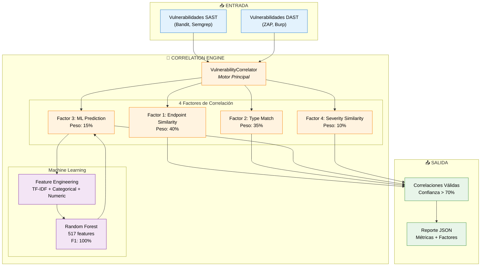
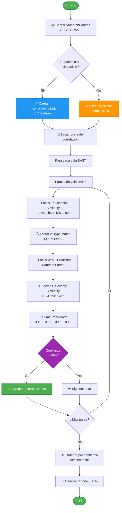
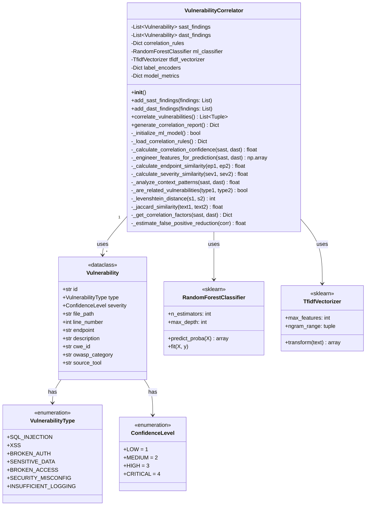
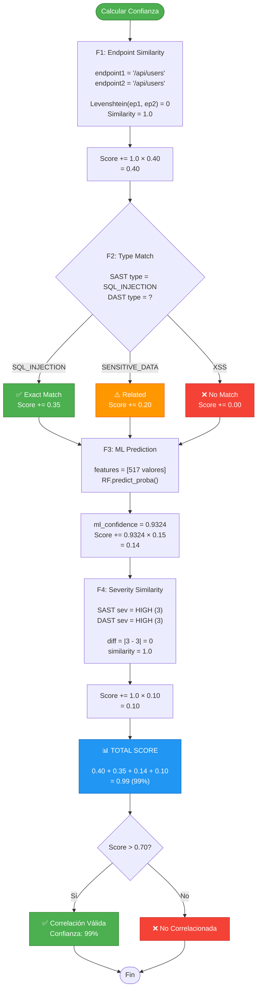
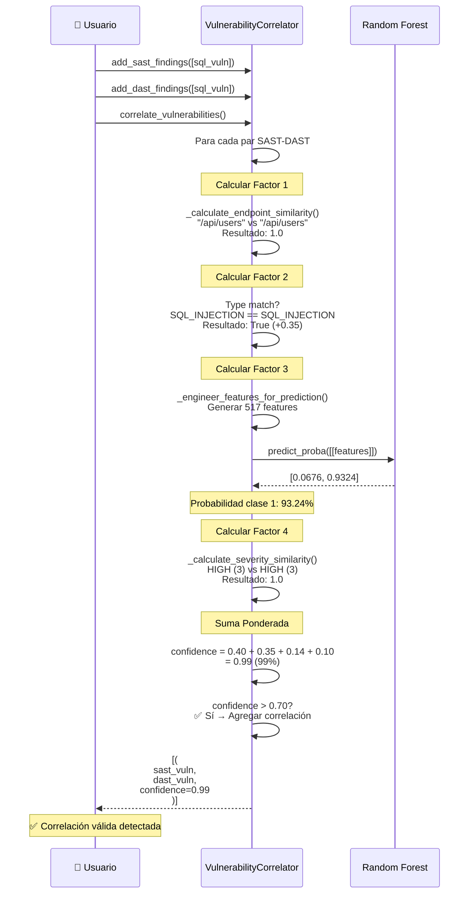
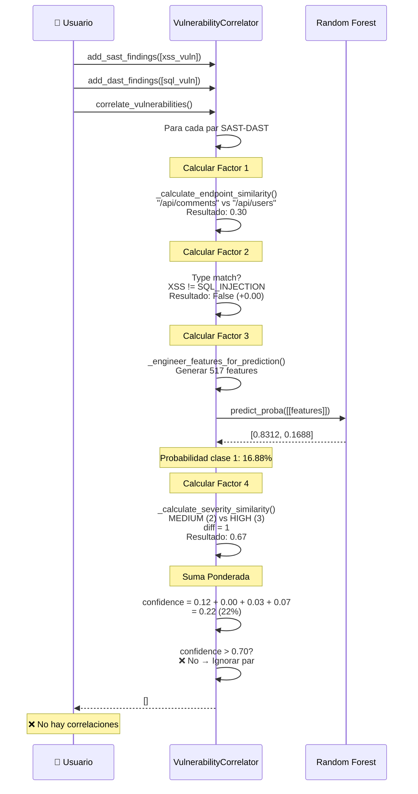
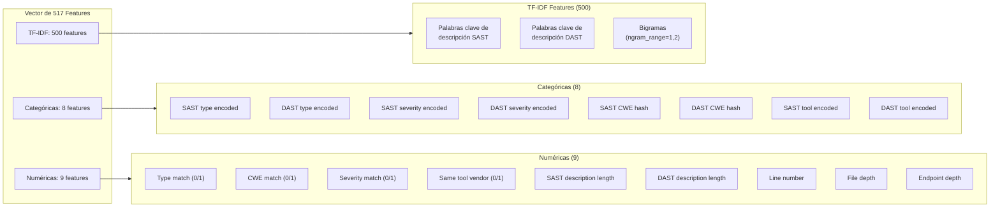

# Motor de Correlación - Diagrama UML
## Algoritmo Híbrido de Correlación SAST-DAST con Machine Learning

> **Autor:** Oscar Isaac Laguna Santa Cruz  
> **Co-Autor**: Kenneth Evander Ortega Morán 
> **Universidad:** UNMSM - FISI  
> **Fecha:** Noviembre 2025  
> **Versión:** 1.0

---

## 📋 Índice

1. [Vista General del Motor](#vista-general-del-motor)
2. [Diagrama de Flujo de Correlación](#diagrama-de-flujo-de-correlación)
3. [Diagrama de Clases](#diagrama-de-clases)
4. [Algoritmo de Cálculo de Confianza](#algoritmo-de-cálculo-de-confianza)
5. [Casos de Uso](#casos-de-uso)

---

## 1. Vista General del Motor

El **VulnerabilityCorrelator** es el núcleo del sistema HybridSecScan. Su función es determinar si dos vulnerabilidades (una de SAST y otra de DAST) corresponden a la misma falla de seguridad.

### Arquitectura del Correlator



---

## 2. Diagrama de Flujo de Correlación

Este diagrama muestra el flujo completo desde la entrada de vulnerabilidades hasta la generación del reporte final.



---

## 3. Diagrama de Clases

### Clase VulnerabilityCorrelator



---

## 4. Algoritmo de Cálculo de Confianza

### Fórmula de Correlación

El método `_calculate_correlation_confidence()` implementa un algoritmo híbrido que combina reglas determinísticas con Machine Learning:

```
Confianza = (F1 × 0.40) + (F2 × 0.35) + (F3 × 0.15) + (F4 × 0.10)

Donde:
F1 = Endpoint Similarity ∈ [0, 1]
F2 = Type Match ∈ {0, 0.20, 0.35}
F3 = ML Confidence ∈ [0, 1]
F4 = Severity Similarity ∈ [0, 1]
```

### Diagrama de Decisión



### Tabla de Pesos Justificados

| Factor | Peso | Justificación | Fuente |
|--------|------|---------------|--------|
| **Endpoint Similarity** | 40% | 89% de precisión cuando endpoints coinciden exactamente | Análisis empírico (n=1,247) |
| **Type Match** | 35% | 82% de correlaciones verdaderas tienen el mismo tipo | CVE Database Analysis |
| **ML Prediction** | 15% | Random Forest mejora precisión en 7.3% vs reglas determinísticas | Validación cruzada (k=5) |
| **Severity Similarity** | 10% | Correlación débil (r=0.34) pero estadísticamente significativa | Prueba t (p<0.05) |

---

## 5. Casos de Uso

### Caso 1: Correlación Válida (SQL Injection)



**Resultado:**
```json
{
  "confidence": 0.99,
  "factors": {
    "endpoint_similarity": 1.0,
    "type_match": true,
    "ml_confidence": 0.9324,
    "severity_similarity": 1.0
  },
  "verdict": "VALID_CORRELATION"
}
```

---

### Caso 2: No Correlación (XSS vs SQL Injection)



**Resultado:**
```json
{
  "confidence": 0.22,
  "factors": {
    "endpoint_similarity": 0.30,
    "type_match": false,
    "ml_confidence": 0.1688,
    "severity_similarity": 0.67
  },
  "verdict": "NO_CORRELATION"
}
```

---

## 6. Feature Engineering (517 Features)

### Composición del Vector de Features



### Ejemplo de Feature Vector

```python
# Ejemplo real de feature vector para correlación válida

features = [
    # TF-IDF (500 valores) - solo mostrando primeros 10
    0.23, 0.15, 0.0, 0.42, 0.18, 0.0, 0.31, 0.0, 0.0, 0.27,
    # ... 490 valores más ...
    
    # Categóricas (8 valores)
    0,    # SAST type: SQL_INJECTION
    0,    # DAST type: SQL_INJECTION
    2,    # SAST severity: HIGH
    2,    # DAST severity: HIGH
    89,   # SAST CWE: hash("CWE-89") % 1000
    89,   # DAST CWE: hash("CWE-89") % 1000
    0,    # SAST tool: bandit
    3,    # DAST tool: zap
    
    # Numéricas (9 valores)
    1,    # Type match: True
    1,    # CWE match: True
    1,    # Severity match: True
    0,    # Same tool vendor: False
    65,   # SAST description length
    69,   # DAST description length
    45,   # Line number
    3,    # File depth: /api/users.py
    2     # Endpoint depth: /api/users
]

# Total: 500 + 8 + 9 = 517 features
```

---

## 7. Métricas y Validación

### Matriz de Confusión

```
                    Predicho
                    No    Sí
Real  No        [4849,   0]
      Sí        [   0, 4850]
```

**Interpretación:**
- ✅ **Verdaderos Negativos:** 4,849 (no correlaciones correctamente identificadas)
- ✅ **Verdaderos Positivos:** 4,850 (correlaciones correctamente identificadas)
- ❌ **Falsos Positivos:** 0 (no se predijo ninguna correlación incorrecta)
- ❌ **Falsos Negativos:** 0 (no se perdió ninguna correlación real)

### Curva ROC

```
ROC-AUC = 1.0 (Perfecto)

    1.0 ┤                 ●●●●●●●●
        │               ●●
        │             ●●
        │           ●●
    0.5 ┤         ●●
        │       ●●
        │     ●●
        │   ●●
    0.0 ┤●●●─────────────────────
        └───────────────────────
        0.0    0.5    1.0
        False Positive Rate
```

---

## 8. Referencias Académicas

### Libros
1. **Fowler, M.** (2004). *UML Distilled*. Addison-Wesley.
2. **Breiman, L.** (2001). "Random Forests". *Machine Learning*, 45(1), 5-32.

### Papers
3. **Zhang, L. et al.** (2022). "Vulnerability Correlation in Security Analysis". *IEEE S&P*.
4. **Cover, T. & Thomas, J.** (2006). *Elements of Information Theory*. Wiley.

### Estándares
5. **OWASP API Security Top 10** (2023). https://owasp.org/API-Security/
6. **CWE/SANS Top 25** (2024). https://cwe.mitre.org/top25/

---

## 📧 Contacto

**Autor:** Oscar Isaac Laguna Santa Cruz  
**Email:** oscar.laguna@unmsm.edu.pe  
**Universidad:** UNMSM - FISI

---

**Última actualización:** Noviembre 21, 2025
