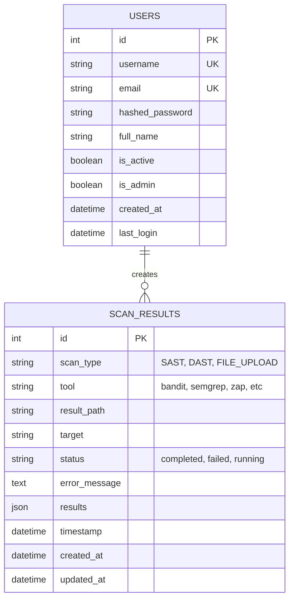

# Esquema de Base de Datos - HybridSecScan
## SQLite + SQLAlchemy ORM

> **Autor:** Oscar Isaac Laguna Santa Cruz  
> **Co-Autor**: Kenneth Evander Ortega Morán 
> **Universidad:** UNMSM - FISI  
> **Fecha:** Noviembre 2025  
> **Versión:** 1.0

---

## 📋 Índice

1. [Diagrama Entidad-Relación](#diagrama-entidad-relación)
2. [Tablas del Sistema](#tablas-del-sistema)
3. [Modelos SQLAlchemy](#modelos-sqlalchemy)
4. [Consultas Frecuentes](#consultas-frecuentes)

---

## 1. Diagrama Entidad-Relación



---

## 2. Tablas del Sistema

### Tabla: `users`

**Descripción:** Almacena información de usuarios del sistema para autenticación y autorización.

| Campo | Tipo | Restricciones | Descripción |
|-------|------|---------------|-------------|
| `id` | INTEGER | PK, AUTO_INCREMENT | Identificador único |
| `username` | VARCHAR | UNIQUE, NOT NULL, INDEX | Nombre de usuario |
| `email` | VARCHAR | UNIQUE, NOT NULL, INDEX | Email del usuario |
| `hashed_password` | VARCHAR | NOT NULL | Contraseña hasheada (bcrypt) |
| `full_name` | VARCHAR | NULL | Nombre completo |
| `is_active` | BOOLEAN | DEFAULT TRUE | Usuario activo/inactivo |
| `is_admin` | BOOLEAN | DEFAULT FALSE | Rol de administrador |
| `created_at` | DATETIME | DEFAULT CURRENT_TIMESTAMP | Fecha de creación |
| `last_login` | DATETIME | NULL | Último inicio de sesión |

**Índices:**
- `idx_users_username` en `username`
- `idx_users_email` en `email`

---

### Tabla: `scan_results`

**Descripción:** Almacena resultados de escaneos SAST, DAST y archivos subidos.

| Campo | Tipo | Restricciones | Descripción |
|-------|------|---------------|-------------|
| `id` | INTEGER | PK, AUTO_INCREMENT | Identificador único |
| `scan_type` | VARCHAR(50) | NOT NULL, INDEX | Tipo: SAST, DAST, FILE_UPLOAD |
| `tool` | VARCHAR(50) | NOT NULL, INDEX | Herramienta: bandit, semgrep, zap |
| `result_path` | VARCHAR(500) | NULL | Ruta al archivo de reporte |
| `target` | VARCHAR(500) | NULL | Código o URL analizada |
| `status` | VARCHAR(20) | DEFAULT 'completed' | completed, failed, running, uploading |
| `error_message` | TEXT | NULL | Mensaje de error si falló |
| `results` | JSON | NULL | Resultados en formato JSON |
| `timestamp` | DATETIME | DEFAULT CURRENT_TIMESTAMP | Timestamp de inicio |
| `created_at` | DATETIME | DEFAULT CURRENT_TIMESTAMP | Fecha de creación |
| `updated_at` | DATETIME | DEFAULT CURRENT_TIMESTAMP | Última actualización |

**Índices:**
- `idx_scan_results_scan_type` en `scan_type`
- `idx_scan_results_tool` en `tool`
- `idx_scan_results_status` en `status`

---

## 3. Modelos SQLAlchemy

### Modelo: User

```python
from sqlalchemy import Column, Integer, String, DateTime, Boolean
from sqlalchemy.ext.declarative import declarative_base
from datetime import datetime, timezone

Base = declarative_base()

class User(Base):
    """Modelo de usuario para autenticación"""
    __tablename__ = "users"
    
    id = Column(Integer, primary_key=True, index=True)
    username = Column(String, unique=True, index=True, nullable=False)
    email = Column(String, unique=True, index=True, nullable=False)
    hashed_password = Column(String, nullable=False)
    full_name = Column(String)
    is_active = Column(Boolean, default=True)
    is_admin = Column(Boolean, default=False)
    created_at = Column(DateTime, default=lambda: datetime.now(timezone.utc))
    last_login = Column(DateTime)
    
    def to_dict(self):
        return {
            "id": self.id,
            "username": self.username,
            "email": self.email,
            "full_name": self.full_name,
            "is_active": self.is_active,
            "is_admin": self.is_admin,
            "created_at": self.created_at.isoformat() if self.created_at else None,
            "last_login": self.last_login.isoformat() if self.last_login else None
        }
```

### Modelo: ScanResult

```python
from sqlalchemy import Column, Integer, String, DateTime, Text, JSON

class ScanResult(Base):
    """Modelo de resultados de escaneo"""
    __tablename__ = 'scan_results'
    
    id = Column(Integer, primary_key=True, index=True)
    scan_type = Column(String(50), index=True)  # SAST, DAST, FILE_UPLOAD
    tool = Column(String(50), index=True)       # bandit, semgrep, zap
    result_path = Column(String(500))
    target = Column(String(500))
    status = Column(String(20), default='completed')
    error_message = Column(Text, nullable=True)
    results = Column(JSON, nullable=True)
    timestamp = Column(DateTime, default=lambda: datetime.now(timezone.utc))
    created_at = Column(DateTime, default=lambda: datetime.now(timezone.utc))
    updated_at = Column(DateTime, 
                       default=lambda: datetime.now(timezone.utc),
                       onupdate=lambda: datetime.now(timezone.utc))
    
    def to_dict(self):
        return {
            "id": self.id,
            "scan_type": self.scan_type,
            "tool": self.tool,
            "result_path": self.result_path,
            "target": self.target,
            "status": self.status,
            "error_message": self.error_message,
            "results": self.results,
            "timestamp": self.timestamp.isoformat() if self.timestamp else None,
            "created_at": self.created_at.isoformat() if self.created_at else None,
            "updated_at": self.updated_at.isoformat() if self.updated_at else None
        }
```

---

## 4. Consultas Frecuentes

### SQL: Obtener últimos escaneos

```sql
SELECT 
    id,
    scan_type,
    tool,
    status,
    timestamp,
    created_at
FROM scan_results
ORDER BY created_at DESC
LIMIT 10;
```

### SQLAlchemy: Obtener últimos escaneos

```python
from database.models import ScanResult, SessionLocal

db = SessionLocal()
recent_scans = db.query(ScanResult)\
    .order_by(ScanResult.created_at.desc())\
    .limit(10)\
    .all()

for scan in recent_scans:
    print(scan.to_dict())
```

### SQL: Filtrar escaneos por tipo y herramienta

```sql
SELECT *
FROM scan_results
WHERE scan_type = 'SAST'
  AND tool = 'bandit'
  AND status = 'completed'
ORDER BY timestamp DESC;
```

### SQLAlchemy: Filtrar escaneos

```python
sast_bandit_scans = db.query(ScanResult)\
    .filter(ScanResult.scan_type == 'SAST')\
    .filter(ScanResult.tool == 'bandit')\
    .filter(ScanResult.status == 'completed')\
    .order_by(ScanResult.timestamp.desc())\
    .all()
```

---

## 5. Configuración de Conexión

### database/models.py

```python
import os
from sqlalchemy import create_engine
from sqlalchemy.orm import sessionmaker

# Configuración de la base de datos
DATABASE_URL = os.getenv("DATABASE_URL", "sqlite:///./database/hybridsecscan.db")

engine = create_engine(
    DATABASE_URL,
    connect_args={"check_same_thread": False}  # Solo para SQLite
)

SessionLocal = sessionmaker(autocommit=False, autoflush=False, bind=engine)

def get_db():
    """Generador de sesiones de base de datos"""
    db = SessionLocal()
    try:
        yield db
    finally:
        db.close()
```

---

## 📧 Contacto

**Autor:** Oscar Isaac Laguna Santa Cruz  
**Universidad:** UNMSM - FISI

---

**Última actualización:** Noviembre 21, 2025
