# Frontend Components - HybridSecScan
## React + TypeScript Dashboard

> **Autor:** Oscar Isaac Laguna Santa Cruz 
> **Co-Autor**: Kenneth Evander Ortega Morán 
> **Universidad:** UNMSM - FISI  
> **Fecha:** Noviembre 2025  
> **Versión:** 1.0

---

## 📋 Índice

1. [Arquitectura del Frontend](#arquitectura-del-frontend)
2. [Árbol de Componentes](#árbol-de-componentes)
3. [Componentes Principales](#componentes-principales)
4. [Gestión de Estado](#gestión-de-estado)
5. [Integración con API](#integración-con-api)
6. [Sistema de Autenticación](#sistema-de-autenticación)

---

## 1. Arquitectura del Frontend


---

## 2. Árbol de Componentes


---

## 3. Componentes Principales

### 3.1 App.tsx (Componente Raíz)


**Código:**
```tsx
import React, { useState, useEffect } from 'react';
import { BrowserRouter, Routes, Route } from 'react-router-dom';
import { AuthContext } from './contexts/AuthContext';
import Dashboard from './pages/Dashboard';
import Login from './pages/Login';
import Scan from './pages/Scan';
import Results from './pages/Results';
import PrivateRoute from './components/PrivateRoute';

function App() {
  const [user, setUser] = useState<User | null>(null);
  const [loading, setLoading] = useState(true);

  useEffect(() => {
    // Cargar usuario desde localStorage al iniciar
    const token = localStorage.getItem('auth_token');
    if (token) {
      verifyToken(token).then(userData => {
        setUser(userData);
        setLoading(false);
      });
    } else {
      setLoading(false);
    }
  }, []);

  const login = async (credentials: LoginCredentials) => {
    const response = await api.post('/auth/login', credentials);
    const { access_token } = response.data;
    localStorage.setItem('auth_token', access_token);
    
    const userData = await api.get('/auth/me');
    setUser(userData.data);
  };

  const logout = () => {
    localStorage.removeItem('auth_token');
    setUser(null);
  };

  if (loading) return <div>Loading...</div>;

  return (
    <AuthContext.Provider value={{ user, login, logout }}>
      <BrowserRouter>
        <Routes>
          <Route path="/login" element={<Login />} />
          <Route path="/" element={
            <PrivateRoute>
              <Dashboard />
            </PrivateRoute>
          } />
          <Route path="/scan" element={
            <PrivateRoute>
              <Scan />
            </PrivateRoute>
          } />
          <Route path="/results" element={
            <PrivateRoute>
              <Results />
            </PrivateRoute>
          } />
        </Routes>
      </BrowserRouter>
    </AuthContext.Provider>
  );
}

export default App;
```

---

### 3.2 Dashboard Component

```mermaid
sequenceDiagram
    participant User
    participant Dashboard
    participant API
    participant Charts
    
    User->>Dashboard: Navegar a "/"
    Dashboard->>Dashboard: useEffect() mount
    
    Dashboard->>API: GET /results/all
    API-->>Dashboard: scan_results[]
    
    Dashboard->>Dashboard: Calcular estadísticas
    Dashboard->>Charts: Renderizar gráficos
    
    Dashboard-->>User: Mostrar dashboard
    
    loop Cada 30 segundos
        Dashboard->>API: GET /results/all
        API-->>Dashboard: updated_results[]
        Dashboard->>Charts: Actualizar gráficos
    end
```



**Código:**
```tsx
import React, { useState, useEffect } from 'react';
import { Header, StatsCards, Charts, RecentScans } from '../components';
import { api } from '../services/api';

interface DashboardStats {
  totalScans: number;
  vulnerabilitiesFound: number;
  correlationsFound: number;
  falsePositivesReduced: string;
}

const Dashboard: React.FC = () => {
  const [stats, setStats] = useState<DashboardStats | null>(null);
  const [recentScans, setRecentScans] = useState([]);
  const [loading, setLoading] = useState(true);

  useEffect(() => {
    fetchDashboardData();
    
    // Actualizar cada 30 segundos
    const interval = setInterval(fetchDashboardData, 30000);
    return () => clearInterval(interval);
  }, []);

  const fetchDashboardData = async () => {
    try {
      const [scansRes, correlationsRes] = await Promise.all([
        api.get('/results/all'),
        api.get('/correlate/reports')
      ]);
      
      const scans = scansRes.data;
      const correlations = correlationsRes.data;
      
      setStats({
        totalScans: scans.length,
        vulnerabilitiesFound: scans.reduce((acc, s) => 
          acc + (s.results?.vulnerabilities?.length || 0), 0),
        correlationsFound: correlations.length,
        falsePositivesReduced: calculateReduction(scans, correlations)
      });
      
      setRecentScans(scans.slice(0, 10));
      setLoading(false);
    } catch (error) {
      console.error('Error fetching dashboard data:', error);
      setLoading(false);
    }
  };

  if (loading) return <div>Cargando...</div>;

  return (
    <div className="dashboard">
      <Header />
      <StatsCards stats={stats} />
      <Charts scans={recentScans} />
      <RecentScans scans={recentScans} />
    </div>
  );
};

export default Dashboard;
```

---

### 3.3 ScanForm Component

```mermaid
stateDiagram-v2
    [*] --> Idle: Initial State
    
    Idle --> SelectingTool: Usuario selecciona herramienta
    SelectingTool --> FillingForm: Usuario ingresa datos
    
    FillingForm --> Validating: Submit formulario
    
    Validating --> InvalidData: Validación falla
    InvalidData --> FillingForm: Corregir errores
    
    Validating --> Submitting: Datos válidos
    Submitting --> Success: API responde 202
    Submitting --> Error: API responde error
    
    Success --> Polling: Iniciar polling de estado
    Polling --> Polling: Cada 5 segundos
    Polling --> Completed: Status = 'completed'
    Polling --> Failed: Status = 'failed'
    
    Error --> Idle: Resetear formulario
    Completed --> Idle: Nuevo escaneo
    Failed --> Idle: Reintentar
```



**Código:**
```tsx
import React, { useState } from 'react';
import { api } from '../services/api';

interface ScanFormData {
  scanType: 'SAST' | 'DAST';
  tool: string;
  targetPath: string;
  options: Record<string, any>;
}

const ScanForm: React.FC = () => {
  const [formData, setFormData] = useState<ScanFormData>({
    scanType: 'SAST',
    tool: 'bandit',
    targetPath: '',
    options: {}
  });
  const [scanning, setScanning] = useState(false);
  const [scanId, setScanId] = useState<string | null>(null);
  const [progress, setProgress] = useState(0);

  const handleSubmit = async (e: React.FormEvent) => {
    e.preventDefault();
    setScanning(true);

    try {
      const endpoint = formData.scanType === 'SAST' 
        ? `/scan/${formData.tool}`
        : `/scan/zap`;
      
      const response = await api.post(endpoint, {
        target_path: formData.targetPath,
        options: formData.options
      });

      setScanId(response.data.scan_id);
      startPolling(response.data.scan_id);
    } catch (error) {
      console.error('Error iniciando escaneo:', error);
      setScanning(false);
    }
  };

  const startPolling = (scanId: string) => {
    const pollInterval = setInterval(async () => {
      try {
        const response = await api.get(`/scan/status/${scanId}`);
        const { status, progress: currentProgress } = response.data;

        setProgress(currentProgress || 0);

        if (status === 'completed' || status === 'failed') {
          clearInterval(pollInterval);
          setScanning(false);
          
          if (status === 'completed') {
            alert('Escaneo completado exitosamente!');
          } else {
            alert('El escaneo falló. Revise los logs.');
          }
        }
      } catch (error) {
        console.error('Error consultando estado:', error);
        clearInterval(pollInterval);
        setScanning(false);
      }
    }, 5000); // Poll cada 5 segundos
  };

  return (
    <form onSubmit={handleSubmit} className="scan-form">
      <div className="form-group">
        <label>Tipo de Escaneo</label>
        <select
          value={formData.scanType}
          onChange={e => setFormData({...formData, scanType: e.target.value as any})}
        >
          <option value="SAST">SAST (Análisis Estático)</option>
          <option value="DAST">DAST (Análisis Dinámico)</option>
        </select>
      </div>

      <div className="form-group">
        <label>Herramienta</label>
        <select
          value={formData.tool}
          onChange={e => setFormData({...formData, tool: e.target.value})}
        >
          {formData.scanType === 'SAST' ? (
            <>
              <option value="bandit">Bandit</option>
              <option value="semgrep">Semgrep</option>
            </>
          ) : (
            <option value="zap">OWASP ZAP</option>
          )}
        </select>
      </div>

      <div className="form-group">
        <label>
          {formData.scanType === 'SAST' ? 'Ruta del Código' : 'URL Objetivo'}
        </label>
        <input
          type="text"
          value={formData.targetPath}
          onChange={e => setFormData({...formData, targetPath: e.target.value})}
          placeholder={formData.scanType === 'SAST' ? '/app/backend' : 'http://localhost:8000'}
          required
        />
      </div>

      <button type="submit" disabled={scanning}>
        {scanning ? `Escaneando... ${progress}%` : 'Iniciar Escaneo'}
      </button>

      {scanning && (
        <div className="progress-bar">
          <div 
            className="progress-fill" 
            style={{ width: `${progress}%` }}
          />
        </div>
      )}
    </form>
  );
};

export default ScanForm;
```

---

### 3.4 CorrelationView Component

```mermaid
graph LR
    subgraph Input["Entrada"]
        SAST[Seleccionar<br/>Scan SAST]
        DAST[Seleccionar<br/>Scan DAST]
    end
    
    subgraph Process["Procesamiento"]
        Correlate[POST /correlate<br/>API Request]
        Wait[Esperar respuesta<br/>~2-5 segundos]
    end
    
    subgraph Output["Salida"]
        Table[Tabla de<br/>Correlaciones]
        Chart[Gráfico de<br/>Confianza]
        Stats[Estadísticas]
    end
    
    SAST --> Correlate
    DAST --> Correlate
    Correlate --> Wait
    Wait --> Table
    Wait --> Chart
    Wait --> Stats
    
    style Correlate fill:#4CAF50,stroke:#2E7D32,color:#fff
    style Table fill:#2196F3,stroke:#1565C0,color:#fff
    style Chart fill:#2196F3,stroke:#1565C0,color:#fff
    style Stats fill:#2196F3,stroke:#1565C0,color:#fff
```



**Código:**
```tsx
import React, { useState } from 'react';
import { api } from '../services/api';
import { PieChart, Pie, Cell, Legend, Tooltip } from 'recharts';

interface Correlation {
  id: string;
  confidence: number;
  sast_vulnerability: any;
  dast_vulnerability: any;
  factors: any;
}

const CorrelationView: React.FC = () => {
  const [sastScanId, setSastScanId] = useState('');
  const [dastScanId, setDastScanId] = useState('');
  const [correlations, setCorrelations] = useState<Correlation[]>([]);
  const [loading, setLoading] = useState(false);

  const handleCorrelate = async () => {
    setLoading(true);
    
    try {
      const response = await api.post('/correlate', {
        sast_scan_id: sastScanId,
        dast_scan_id: dastScanId,
        min_confidence: 0.70,
        use_ml: true
      });

      setCorrelations(response.data.correlations);
    } catch (error) {
      console.error('Error correlacionando:', error);
    } finally {
      setLoading(false);
    }
  };

  const getConfidenceColor = (confidence: number) => {
    if (confidence >= 0.9) return '#4CAF50'; // Verde
    if (confidence >= 0.7) return '#FF9800'; // Naranja
    return '#F44336'; // Rojo
  };

  const chartData = [
    { name: 'Alta (>90%)', value: correlations.filter(c => c.confidence >= 0.9).length },
    { name: 'Media (70-90%)', value: correlations.filter(c => c.confidence >= 0.7 && c.confidence < 0.9).length },
    { name: 'Baja (<70%)', value: correlations.filter(c => c.confidence < 0.7).length }
  ];

  return (
    <div className="correlation-view">
      <div className="form-section">
        <input
          type="text"
          placeholder="SAST Scan ID"
          value={sastScanId}
          onChange={e => setSastScanId(e.target.value)}
        />
        <input
          type="text"
          placeholder="DAST Scan ID"
          value={dastScanId}
          onChange={e => setDastScanId(e.target.value)}
        />
        <button onClick={handleCorrelate} disabled={loading}>
          {loading ? 'Correlacionando...' : 'Correlacionar'}
        </button>
      </div>

      {correlations.length > 0 && (
        <>
          <div className="stats-section">
            <h3>Resumen</h3>
            <p>Total de correlaciones: {correlations.length}</p>
            <p>Alta confianza: {correlations.filter(c => c.confidence >= 0.9).length}</p>
            <p>Media confianza: {correlations.filter(c => c.confidence >= 0.7 && c.confidence < 0.9).length}</p>
          </div>

          <div className="chart-section">
            <PieChart width={400} height={300}>
              <Pie
                data={chartData}
                cx={200}
                cy={150}
                labelLine={false}
                label
                outerRadius={80}
                fill="#8884d8"
                dataKey="value"
              >
                {chartData.map((entry, index) => (
                  <Cell key={`cell-${index}`} fill={['#4CAF50', '#FF9800', '#F44336'][index]} />
                ))}
              </Pie>
              <Tooltip />
              <Legend />
            </PieChart>
          </div>

          <div className="table-section">
            <table>
              <thead>
                <tr>
                  <th>SAST Vuln</th>
                  <th>DAST Vuln</th>
                  <th>Confianza</th>
                  <th>Factores</th>
                </tr>
              </thead>
              <tbody>
                {correlations.map(corr => (
                  <tr key={corr.id}>
                    <td>
                      {corr.sast_vulnerability.type}<br/>
                      <small>{corr.sast_vulnerability.file}:{corr.sast_vulnerability.line}</small>
                    </td>
                    <td>
                      {corr.dast_vulnerability.type}<br/>
                      <small>{corr.dast_vulnerability.endpoint}</small>
                    </td>
                    <td>
                      <span 
                        className="confidence-badge"
                        style={{ backgroundColor: getConfidenceColor(corr.confidence) }}
                      >
                        {(corr.confidence * 100).toFixed(1)}%
                      </span>
                    </td>
                    <td>
                      <ul>
                        <li>Endpoint: {(corr.factors.endpoint_similarity * 100).toFixed(0)}%</li>
                        <li>Type Match: {corr.factors.type_match ? 'Sí' : 'No'}</li>
                        <li>ML: {(corr.factors.ml_confidence * 100).toFixed(0)}%</li>
                      </ul>
                    </td>
                  </tr>
                ))}
              </tbody>
            </table>
          </div>
        </>
      )}
    </div>
  );
};

export default CorrelationView;
```

---

## 4. Gestión de Estado

### AuthContext

```typescript
import React, { createContext, useContext, useState } from 'react';

interface User {
  id: number;
  username: string;
  email: string;
  is_admin: boolean;
}

interface AuthContextType {
  user: User | null;
  login: (credentials: LoginCredentials) => Promise<void>;
  logout: () => void;
  isAuthenticated: boolean;
}

const AuthContext = createContext<AuthContextType | undefined>(undefined);

export const useAuth = () => {
  const context = useContext(AuthContext);
  if (!context) {
    throw new Error('useAuth must be used within AuthProvider');
  }
  return context;
};

export const AuthProvider: React.FC<{ children: React.ReactNode }> = ({ children }) => {
  const [user, setUser] = useState<User | null>(null);

  const login = async (credentials: LoginCredentials) => {
    const response = await api.post('/auth/login', credentials);
    localStorage.setItem('auth_token', response.data.access_token);
    
    const userResponse = await api.get('/auth/me');
    setUser(userResponse.data);
  };

  const logout = () => {
    localStorage.removeItem('auth_token');
    setUser(null);
  };

  return (
    <AuthContext.Provider value={{
      user,
      login,
      logout,
      isAuthenticated: !!user
    }}>
      {children}
    </AuthContext.Provider>
  );
};
```

---

## 5. Integración con API

### API Service (Axios)

```typescript
import axios from 'axios';

const api = axios.create({
  baseURL: 'http://localhost:8000',
  timeout: 30000,
  headers: {
    'Content-Type': 'application/json'
  }
});

// Interceptor para agregar token JWT
api.interceptors.request.use(config => {
  const token = localStorage.getItem('auth_token');
  if (token) {
    config.headers.Authorization = `Bearer ${token}`;
  }
  return config;
});

// Interceptor para manejar errores
api.interceptors.response.use(
  response => response,
  error => {
    if (error.response?.status === 401) {
      localStorage.removeItem('auth_token');
      window.location.href = '/login';
    }
    return Promise.reject(error);
  }
);

export { api };
```

---

## 📚 Referencias

- **React**: https://react.dev/
- **TypeScript**: https://www.typescriptlang.org/
- **Vite**: https://vitejs.dev/
- **Recharts**: https://recharts.org/

---

## 📧 Contacto

**Autor:** Oscar Isaac Laguna Santa Cruz  
**Universidad:** UNMSM - FISI

---

**Última actualización:** Noviembre 21, 2025
