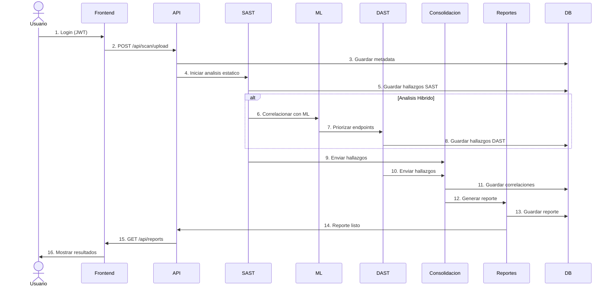

# Diagrama de Proceso Completo - HybridSecScan

> **Proyecto:** Sistema de Auditoria Automatizada Hibrida (SAST + DAST)  
> **Autor:** Oscar Isaac Laguna Santa Cruz  
> **Universidad:** UNMSM - Facultad de Ingenieria de Sistemas e Informatica  
> **Fecha:** Noviembre 2025  
> **Version:** 1.0

---

## Descripcion General

Este diagrama muestra el flujo de proceso completo de la aplicacion HybridSecScan desde que el usuario inicia una auditoria hasta que obtiene el reporte final consolidado. Incluye todos los modulos del sistema y sus interacciones.

---

## Diagrama de Proceso End-to-End (Horizontal)

```mermaid
flowchart LR
    %% Inicio
    START((Inicio)) --> A1[Login Usuario<br/>Autenticacion JWT]
    
    %% Usuario/Frontend
    A1 --> A2[Seleccionar tipo<br/>SAST/DAST/Hibrido]
    A2 --> A3[Cargar OpenAPI<br/>Swagger/YAML]
    A3 --> A4[Configurar<br/>parametros]
    
    %% API Gateway
    A4 --> B1[POST /api/scan/upload<br/>Validar archivo]
    B1 --> B2[Extraer endpoints<br/>y parametros]
    B2 --> B3[Guardar metadata<br/>en BD]
    
    %% Decision de tipo de analisis
    B3 --> DECISION{Tipo de<br/>analisis?}
    
    %% Rama SAST
    DECISION -->|SAST o Hibrido| C1[Inicializar<br/>Semgrep]
    C1 --> C2[Analisis sintactico<br/>y semantico]
    C2 --> C3[Detectar<br/>vulnerabilidades]
    C3 --> C4[Generar hallazgos<br/>SAST JSON]
    
    %% Rama decision hibrido
    C4 --> HYBRID{Es analisis<br/>hibrido?}
    
    %% Correlacion ML
    HYBRID -->|Si| D1[Cargar modelo<br/>Random Forest]
    D1 --> D2[Extraer features<br/>15 caracteristicas]
    D2 --> D3[Predecir correlacion<br/>Probabilidad]
    D3 --> D4[Priorizar endpoints<br/>criticos]
    
    %% DAST
    DECISION -->|DAST| E1
    D4 --> E1[Inicializar Docker<br/>OWASP ZAP]
    E1 --> E2[Configurar contexto<br/>y autenticacion]
    E2 --> E3[Importar OpenAPI<br/>a ZAP]
    E3 --> E4[Generar casos<br/>de prueba]
    E4 --> E5[Ejecutar ataques<br/>Fuzzing/Inyeccion]
    E5 --> E6[Obtener resultados<br/>ZAP alertas]
    
    %% Consolidacion
    HYBRID -->|No| F1
    C4 --> F1[Unificar hallazgos<br/>SAST + DAST]
    E6 --> F1
    F1 --> F2[Normalizar<br/>formato]
    F2 --> F3[Correlacionar<br/>duplicados ML]
    F3 --> F4[Eliminar falsos<br/>positivos]
    F4 --> F5[Asignar severidad<br/>CVSS]
    F5 --> F6[Clasificar OWASP<br/>API Top 10]
    
    %% Evaluacion
    F6 --> G1[Calcular metricas<br/>Total vulns]
    G1 --> G2[Score seguridad<br/>0-100 puntos]
    G2 --> G3[Nivel de riesgo<br/>Critico/Alto/Medio/Bajo]
    
    %% Reportes
    G3 --> H1[Generar estructura<br/>reporte]
    H1 --> H2[Organizar por<br/>severidad]
    H2 --> H3[Anadir<br/>recomendaciones]
    H3 --> H4[Incluir evidencias<br/>y graficos]
    
    %% Salidas
    H4 --> OUT1[PDF<br/>Ejecutivo]
    H4 --> OUT2[JSON<br/>Programatico]
    H4 --> OUT3[Dashboard<br/>Web]
    
    %% Finalizacion
    OUT1 --> END1((Fin))
    OUT2 --> END1
    OUT3 --> END1
    
    %% Base de datos (conexiones punteadas)
    B3 -.-> DB[(Base de Datos<br/>SQLite)]
    C4 -.-> DB
    E6 -.-> DB
    F3 -.-> DB
    H4 -.-> DB
    
    %% Notificaciones
    H4 -.-> NOTIF[Email/Webhook<br/>Notificaciones]
    
    %% Estilos
    classDef startEnd fill:#2ECC71,stroke:#27AE60,stroke-width:4px,color:#fff
    classDef userStyle fill:#4A90E2,stroke:#2E5C8A,stroke-width:2px,color:#fff
    classDef apiStyle fill:#009688,stroke:#00695C,stroke-width:2px,color:#fff
    classDef decisionStyle fill:#FFB84D,stroke:#E59400,stroke-width:3px,color:#000
    classDef sastStyle fill:#9B59B6,stroke:#7D3C98,stroke-width:2px,color:#fff
    classDef mlStyle fill:#F39C12,stroke:#D68910,stroke-width:2px,color:#fff
    classDef dastStyle fill:#E74C3C,stroke:#C0392B,stroke-width:2px,color:#fff
    classDef consolidacionStyle fill:#16A085,stroke:#117A65,stroke-width:2px,color:#fff
    classDef evaluacionStyle fill:#3498DB,stroke:#2471A3,stroke-width:2px,color:#fff
    classDef reportesStyle fill:#27AE60,stroke:#1E8449,stroke-width:2px,color:#fff
    classDef outputStyle fill:#50C878,stroke:#3AA65D,stroke-width:3px,color:#fff
    classDef dbStyle fill:#34495E,stroke:#212F3C,stroke-width:2px,color:#fff
    classDef notifStyle fill:#95A5A6,stroke:#7B7D7D,stroke-width:2px,color:#fff
    
    class START,END1 startEnd
    class A1,A2,A3,A4 userStyle
    class B1,B2,B3 apiStyle
    class DECISION,HYBRID decisionStyle
    class C1,C2,C3,C4 sastStyle
    class D1,D2,D3,D4 mlStyle
    class E1,E2,E3,E4,E5,E6 dastStyle
    class F1,F2,F3,F4,F5,F6 consolidacionStyle
    class G1,G2,G3 evaluacionStyle
    class H1,H2,H3,H4 reportesStyle
    class OUT1,OUT2,OUT3 outputStyle
    class DB dbStyle
    class NOTIF notifStyle
```



---

## Diagrama con Swimlanes Horizontales

```mermaid
graph LR
    subgraph Capa1[" USUARIO / FRONTEND "]
        direction LR
        U1[Inicio Login] --> U2[Configurar<br/>Auditoria]
        U2 --> U3[Cargar<br/>OpenAPI]
        U3 --> U4[Iniciar<br/>Escaneo]
    end
    
    subgraph Capa2[" API REST / VALIDACION "]
        direction LR
        A1[Recibir<br/>archivo] --> A2[Validar<br/>esquema]
        A2 --> A3[Extraer<br/>endpoints]
        A3 --> A4[Guardar<br/>metadata]
    end
    
    subgraph Capa3[" SAST - ANALISIS ESTATICO "]
        direction LR
        S1[Iniciar<br/>Semgrep] --> S2[Analisis<br/>estatico]
        S2 --> S3[Detectar<br/>patrones]
        S3 --> S4[Hallazgos<br/>SAST]
    end
    
    subgraph Capa4[" MOTOR DE CORRELACION ML "]
        direction LR
        M1{Analisis<br/>hibrido?} -->|Si| M2[Modelo<br/>ML]
        M2 --> M3[Predecir<br/>correlacion]
        M3 --> M4[Priorizar<br/>endpoints]
    end
    
    subgraph Capa5[" DAST - ANALISIS DINAMICO "]
        direction LR
        D1[Docker<br/>ZAP] --> D2[Config<br/>contexto]
        D2 --> D3[Ejecutar<br/>ataques]
        D3 --> D4[Hallazgos<br/>DAST]
    end
    
    subgraph Capa6[" CONSOLIDACION Y EVALUACION "]
        direction LR
        C1[Unificar<br/>resultados] --> C2[Correlacionar<br/>duplicados]
        C2 --> C3[Asignar<br/>severidad]
        C3 --> C4[Score<br/>seguridad]
    end
    
    subgraph Capa7[" REPORTES Y SALIDA "]
        direction LR
        R1[Generar<br/>reporte] --> R2[PDF]
        R1 --> R3[JSON]
        R1 --> R4[Dashboard]
    end
    
    U4 --> A1
    A4 --> S1
    S4 --> M1
    M1 -->|No| C1
    M4 --> D1
    D4 --> C1
    S4 --> C1
    C4 --> R1
    
    DB[(Database)] -.-> A4
    DB -.-> S4
    DB -.-> D4
    DB -.-> C2
    DB -.-> R1
    
    style Capa1 fill:#E3F2FD,stroke:#1976D2,stroke-width:2px
    style Capa2 fill:#E8F5E9,stroke:#388E3C,stroke-width:2px
    style Capa3 fill:#F3E5F5,stroke:#7B1FA2,stroke-width:2px
    style Capa4 fill:#FFF3E0,stroke:#F57C00,stroke-width:2px
    style Capa5 fill:#FFEBEE,stroke:#C62828,stroke-width:2px
    style Capa6 fill:#E0F2F1,stroke:#00695C,stroke-width:2px
    style Capa7 fill:#E8F5E9,stroke:#2E7D32,stroke-width:2px
```



---

## Descripcion Detallada del Flujo

### Fase 1: Autenticacion y Configuracion

**Actores:** Usuario, Frontend, API

1. **Inicio de Sesion**: Usuario se autentica con credenciales (JWT token)
2. **Dashboard**: Visualiza proyectos y auditorias previas
3. **Seleccion de Analisis**: Elige tipo (SAST, DAST o Hibrido)
4. **Carga de Archivo**: Upload de especificacion OpenAPI/Swagger
5. **Configuracion**: Define parametros de auditoria (severidad, alcance)

**Tiempo estimado:** 2-3 minutos

---

### Fase 2: Validacion de Entrada

**Actores:** API, Modulo de Validacion, Base de Datos

1. **Recepcion**: API recibe archivo OpenAPI via `POST /api/scan/upload`
2. **Validacion de Schema**: Verifica formato JSON/YAML conforme a OpenAPI 3.0
3. **Extraccion de Endpoints**: Parsea paths, methods, parameters
4. **Identificacion de Parametros**: Detecta query, body, headers, path params
5. **Persistencia**: Guarda metadata en base de datos

**Tiempo estimado:** 10-30 segundos

---

### Fase 3: Analisis Estatico (SAST)

**Actores:** Modulo SAST, Semgrep, Base de Datos

1. **Inicializacion**: Carga reglas de Semgrep para OWASP API Top 10
2. **Analisis Sintactico**: Valida estructura del esquema OpenAPI
3. **Analisis Semantico**: Busca patrones de vulnerabilidad en definiciones
4. **Deteccion de Vulnerabilidades**:
   - API1: Broken Object Level Authorization (BOLA)
   - API2: Broken Authentication
   - API3: Broken Object Property Level Authorization
   - API5: Broken Function Level Authorization
   - API8: Security Misconfiguration
   - API9: Improper Inventory Management
   - API10: Unsafe Consumption of APIs

5. **Generacion de Hallazgos**: Formato JSON estructurado con:
   - Tipo de vulnerabilidad
   - Endpoint afectado
   - Severidad (Critical, High, Medium, Low)
   - CWE ID
   - Linea de codigo (si aplica)
   - Recomendacion de mitigacion

**Tiempo estimado:** 1-2 minutos

---

### Fase 4: Correlacion con Machine Learning

**Actores:** Motor de Correlacion, Modelo Random Forest

**Condicion:** Solo si el usuario selecciono analisis Hibrido

1. **Carga del Modelo**: Modelo pre-entrenado Random Forest (85% accuracy)
2. **Extraccion de Features**: 15 caracteristicas por hallazgo SAST:
   - Tipo de vulnerabilidad
   - Metodo HTTP
   - Presencia de autenticacion
   - Numero de parametros
   - Tipo de datos (sensibles vs no sensibles)
   - Profundidad del endpoint
   - Uso de headers de seguridad
   - Esquema de validacion

3. **Prediccion**: Probabilidad de confirmacion en DAST (0.0 - 1.0)
4. **Calculo de Confianza**: 4 factores ponderados:
   - Similitud de endpoint (30%)
   - Coincidencia de tipo de vulnerabilidad (40%)
   - Severidad concordante (20%)
   - Timestamp proximity (10%)

5. **Priorizacion**: Top N endpoints criticos para pruebas dinamicas

**Tiempo estimado:** 30-60 segundos

---

### Fase 5: Analisis Dinamico (DAST)

**Actores:** Modulo DAST, OWASP ZAP, Docker

**Condicion:** Solo si el usuario selecciono DAST o Hibrido

1. **Inicializacion de Contenedor**: Docker ejecuta OWASP ZAP en modo daemon
2. **Configuracion de ZAP**: 
   - Modo API (headless)
   - Context con URL base
   - Authentication (si se proporciona)
   - Politicas de escaneo (pasivo + activo)

3. **Importacion de Esquema**: ZAP carga OpenAPI para generar requests
4. **Generacion de Casos de Prueba**: 
   - Fuzzing de parametros
   - Inyeccion SQL (SQLi)
   - Cross-Site Scripting (XSS)
   - BOLA (modificacion de IDs)
   - Mass Assignment
   - Security Misconfiguration

5. **Ejecucion de Ataques**: Requests maliciosos a endpoints reales
6. **Captura de Resultados**: Alertas, evidencias, screenshots, requests/responses

**Tiempo estimado:** 5-15 minutos (depende de cantidad de endpoints)

---

### Fase 6: Consolidacion de Resultados

**Actores:** Modulo de Consolidacion, Motor de Correlacion

1. **Recepcion**: Hallazgos de SAST y DAST (formato JSON)
2. **Normalizacion**: Esquema unificado para ambos tipos de hallazgos
3. **Correlacion de Duplicados**: 
   - ML: Modelo predice matches con 85% accuracy
   - Reglas: Heuristicas para casos obvios (mismo endpoint + mismo CWE)

4. **Eliminacion de Falsos Positivos**: Validacion cruzada SAST-DAST
5. **Asignacion de Severidad**: CVSS v3.1 scoring
6. **Clasificacion OWASP**: Mapeo a OWASP API Security Top 10 (2023)

**Tiempo estimado:** 1-2 minutos

---

### Fase 7: Sistema de Evaluacion

**Actores:** Sistema de Evaluacion

1. **Calculo de Metricas**:
   - Total de vulnerabilidades encontradas
   - Distribucion por severidad
   - Distribucion por tipo OWASP

2. **Score de Seguridad**: Formula ponderada (0-100 puntos)
   ```
   Score = 100 - (Critical*10 + High*5 + Medium*2 + Low*0.5)
   ```

3. **Comparacion con Baseline**: Historico de auditorias previas
4. **Nivel de Riesgo**:
   - Critico: Score < 40
   - Alto: Score 40-59
   - Medio: Score 60-79
   - Bajo: Score >= 80

**Tiempo estimado:** 10-20 segundos

---

### Fase 8: Generacion de Reportes

**Actores:** Modulo de Reportes

1. **Estructura del Reporte**:
   - Resumen ejecutivo
   - Score de seguridad
   - Distribucion de vulnerabilidades
   - Hallazgos detallados (ordenados por severidad)
   - Recomendaciones de mitigacion
   - Referencias OWASP

2. **Organizacion por Severidad**: Critical > High > Medium > Low
3. **Recomendaciones**: Guias de mitigacion especificas por tipo de vulnerabilidad
4. **Evidencias**: Screenshots, requests HTTP, responses
5. **Graficos**: Charts de distribucion (Pie, Bar, Timeline)

**Formatos de salida:**
- **PDF**: Reporte ejecutivo para gerencia (6-20 paginas)
- **JSON**: Formato programatico para CI/CD
- **Dashboard Web**: Visualizacion interactiva con filtros

**Tiempo estimado:** 30-60 segundos

---

### Fase 9: Notificaciones y Persistencia

**Actores:** Sistema de Notificaciones, Base de Datos

1. **Email**: Notificacion al usuario con link al reporte
2. **Webhook**: Callback a sistema CI/CD (Jenkins, GitLab CI)
3. **Logs**: Registro de eventos en sistema de auditoria
4. **Base de Datos**: Persistencia de todos los hallazgos y reportes

**Tiempo estimado:** 5-10 segundos

---

## Tiempos Totales Estimados

| Tipo de Analisis | Tiempo Minimo | Tiempo Maximo |
|------------------|---------------|---------------|
| SAST Solamente | 2 minutos | 5 minutos |
| DAST Solamente | 6 minutos | 18 minutos |
| Hibrido (SAST + ML + DAST) | 9 minutos | 20 minutos |

**Factores que afectan el tiempo:**
- Cantidad de endpoints en la API (10-100+)
- Complejidad de los endpoints (parametros, autenticacion)
- Tipo de escaneo DAST (pasivo vs activo)
- Recursos del servidor (CPU, RAM)
- Latencia de red (si API esta remota)

---

## Diagrama de Secuencia Simplificado



---

## Casos de Uso

### Caso de Uso 1: Auditoria Rapida (Solo SAST)

**Escenario:** Desarrollador quiere validar su OpenAPI antes de commit

**Flujo:**
1. Login en dashboard
2. Upload de archivo `openapi.yaml`
3. Seleccionar "SAST Solamente"
4. Iniciar auditoria
5. Esperar 2 minutos
6. Descargar reporte PDF

**Resultado esperado:** Reporte con vulnerabilidades estaticas detectadas

---

### Caso de Uso 2: Auditoria Completa (Hibrido)

**Escenario:** Equipo de seguridad audita API en produccion

**Flujo:**
1. Login en dashboard
2. Upload de archivo OpenAPI + URL base de API
3. Seleccionar "Analisis Hibrido"
4. Configurar nivel de severidad: "All"
5. Iniciar auditoria
6. Monitor de progreso en tiempo real
7. Esperar 12 minutos
8. Revisar dashboard interactivo
9. Descargar reporte PDF para gerencia
10. Descargar JSON para CI/CD

**Resultado esperado:** Reporte consolidado con vulnerabilidades confirmadas

---

### Caso de Uso 3: Integracion CI/CD

**Escenario:** Pipeline automatizado de Jenkins

**Flujo:**
1. Commit en repositorio dispara webhook
2. Jenkins ejecuta `curl` a API HybridSecScan
3. Upload de OpenAPI automatico
4. Espera asincronica (polling cada 30s)
5. Descarga JSON con resultados
6. Parsea JSON y bloquea deploy si Critical > 0
7. Envia notificacion a Slack con resultados

**Resultado esperado:** Pipeline bloqueado si hay vulnerabilidades criticas

---

## Patrones de Diseño Aplicados

1. **Strategy Pattern**: Seleccion de tipo de analisis (SAST/DAST/Hibrido)
2. **Factory Pattern**: Creacion de escaneres (Semgrep, ZAP)
3. **Observer Pattern**: Monitor de progreso en tiempo real
4. **Chain of Responsibility**: Pipeline de validacion y procesamiento
5. **Singleton Pattern**: Conexion a base de datos
6. **Facade Pattern**: API REST oculta complejidad interna

---

## Consideraciones de Seguridad

### Autenticacion y Autorizacion
- JWT tokens con expiracion (24h)
- Refresh tokens para sesiones largas
- RBAC: Admin, Auditor, Developer

### Proteccion de Datos Sensibles
- Encriptacion de credenciales en BD (bcrypt)
- HTTPS obligatorio en produccion
- API keys para integraciones CI/CD

### Rate Limiting
- 10 auditorias/hora por usuario
- 100 auditorias/dia por organizacion

### Logs de Auditoria
- Quien ejecuto la auditoria
- Cuando se ejecuto
- Que endpoints se escanearon
- Resultados obtenidos

---

## Metricas de Rendimiento

### Recursos del Sistema

| Componente | CPU | RAM | Disco |
|------------|-----|-----|-------|
| Backend FastAPI | 10-30% | 512MB | 100MB |
| SAST (Semgrep) | 20-40% | 256MB | 50MB |
| DAST (OWASP ZAP) | 40-80% | 2GB | 500MB |
| ML Correlation | 15-25% | 512MB | 200MB |
| Database (SQLite) | 5-10% | 128MB | 1GB |
| **Total** | **90-185%** | **3.4GB** | **1.85GB** |

**Recomendacion:** Servidor con 4 CPU cores, 8GB RAM, 10GB disco

---

## Limitaciones y Trabajo Futuro

### Limitaciones Actuales
- Solo soporta OpenAPI 3.0 (no soporta Swagger 2.0)
- DAST requiere API accesible via HTTP (no APIs internas)
- Modelo ML entrenado con 500 samples (necesita mas datos)
- No soporta autenticacion OAuth2 compleja en DAST

### Mejoras Futuras
- Soporte para GraphQL APIs
- Integracion con Postman Collections
- Deteccion de API drift (cambios no documentados)
- Reentrenamiento continuo del modelo ML
- Soporte para WebSockets y gRPC

---

## Referencias

### Estandares
- **OWASP API Security Top 10 (2023)**: https://owasp.org/API-Security/
- **OpenAPI Specification 3.0**: https://spec.openapis.org/oas/v3.0.0
- **CVSS v3.1**: https://www.first.org/cvss/v3.1/specification-document

### Herramientas
- **Semgrep**: https://semgrep.dev/
- **OWASP ZAP**: https://www.zaproxy.org/
- **FastAPI**: https://fastapi.tiangolo.com/
- **Scikit-learn**: https://scikit-learn.org/

---

## Contacto

**Autor:** Oscar Isaac Laguna Santa Cruz  
**Email:** oscar.laguna@unmsm.edu.pe  
**Universidad:** UNMSM - FISI  
**Proyecto:** HybridSecScan  
**Repositorio:** https://github.com/OscarILS/HybridSecScan

---

**Ultima actualizacion:** Noviembre 23, 2025
