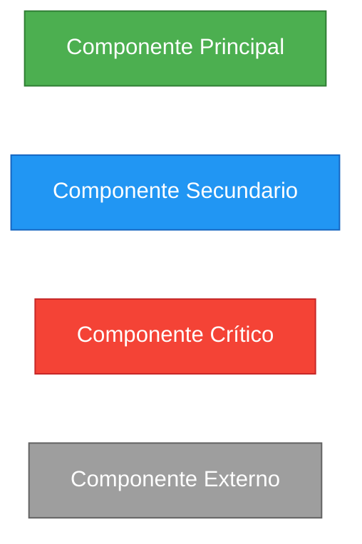

# 📐 Documentación UML - HybridSecScan

> **Proyecto:** Sistema de Auditoría Automatizada Híbrida (SAST + DAST)  
> **Autor:** Oscar Isaac Laguna Santa Cruz  
> **Universidad:** UNMSM - Facultad de Ingeniería de Sistemas e Informática  
> **Fecha:** Noviembre 2025

---

## 📋 Índice de Diagramas UML

Esta carpeta contiene toda la documentación UML del sistema HybridSecScan, organizada en orden lógico para facilitar la comprensión de la arquitectura, diseño e implementación del sistema.

### 1️⃣ **Arquitectura del Sistema** 
📄 [`01_SYSTEM_ARCHITECTURE.md`](01_SYSTEM_ARCHITECTURE.md)

**Contenido:**
- ✅ Vista general del sistema (6 capas)
- ✅ Diagrama de clases (Backend + Frontend)
- ✅ Diagramas de secuencia (4 flujos principales)
- ✅ Diagrama de componentes
- ✅ Diagrama de estados
- ✅ Diagrama de despliegue
- ✅ Estructura de paquetes
- ✅ Patrones de diseño aplicados

**¿Cuándo usar este diagrama?**
- Para entender la arquitectura general del sistema
- Para documentar en el **Capítulo 4** de la tesis (Diseño e Implementación)
- Para presentaciones y defensa de tesis

---

### 2️⃣ **Pipeline de Entrenamiento ML**
📄 [`02_ML_TRAINING_PIPELINE.md`](02_ML_TRAINING_PIPELINE.md)

**Contenido:**
- ✅ Diagrama de flujo del entrenamiento (7 fases)
- ✅ Diagrama de secuencia del pipeline
- ✅ Diagrama de clases del trainer
- ✅ Métricas de evaluación (tablas completas)
- ✅ Consideraciones académicas para tesis
- ✅ Ejemplos de uso del modelo

**¿Cuándo usar este diagrama?**
- Para explicar el proceso de Machine Learning
- Para documentar en el **Capítulo 5** de la tesis (Validación Experimental)
- Para justificar decisiones de feature engineering

---

### 3️⃣ **Motor de Correlación**
📄 [`03_CORRELATION_ENGINE.md`](03_CORRELATION_ENGINE.md)

**Contenido:**
- ✅ Algoritmo de correlación híbrido (Reglas + ML)
- ✅ Diagrama de flujo de decisión
- ✅ Diagrama de clases del correlator
- ✅ Cálculo de confianza (4 factores ponderados)
- ✅ Ejemplos de correlación válida vs inválida

**¿Cuándo usar este diagrama?**
- Para entender el núcleo del sistema (correlation engine)
- Para explicar cómo funciona la correlación SAST-DAST
- Para documentar el algoritmo principal en la tesis

---

### 4️⃣ **API REST y Endpoints**
📄 [`04_API_ENDPOINTS.md`](04_API_ENDPOINTS.md)

**Contenido:**
- ✅ Mapa completo de endpoints (FastAPI)
- ✅ Diagramas de secuencia para cada endpoint
- ✅ Modelos de request/response (Pydantic)
- ✅ Autenticación y autorización (JWT)
- ✅ Manejo de errores y validaciones

**¿Cuándo usar este diagrama?**
- Para documentar la API REST en la tesis
- Para integración con el frontend
- Para pruebas de API (Postman, curl)

---

### 5️⃣ **Base de Datos**
📄 [`05_DATABASE_SCHEMA.md`](05_DATABASE_SCHEMA.md)

**Contenido:**
- ✅ Esquema de base de datos (SQLAlchemy)
- ✅ Diagrama entidad-relación (ER)
- ✅ Tablas: users, scan_results, correlations
- ✅ Índices y optimizaciones
- ✅ Consultas SQL frecuentes

**¿Cuándo usar este diagrama?**
- Para entender el modelo de datos
- Para optimización de consultas
- Para documentar la persistencia de datos

---

### 6️⃣ **Frontend - React Dashboard**
📄 [`06_FRONTEND_COMPONENTS.md`](06_FRONTEND_COMPONENTS.md)

**Contenido:**
- ✅ Árbol de componentes React
- ✅ Flujo de estado (props/hooks)
- ✅ Integración con API REST
- ✅ Componentes de visualización (charts)
- ✅ Manejo de autenticación (JWT tokens)

**¿Cuándo usar este diagrama?**
- Para entender la arquitectura del frontend
- Para desarrollo de nuevas funcionalidades
- Para documentar la interfaz de usuario

---

## 🎯 Guía de Uso para Tesis

### Capítulo 3: Marco Teórico
- No requiere diagramas UML específicos
- Usar referencias bibliográficas solamente

### Capítulo 4: Diseño e Implementación
**Diagramas recomendados:**
1. ✅ **01_SYSTEM_ARCHITECTURE.md** → Sección 4.1 (Arquitectura General)
2. ✅ **03_CORRELATION_ENGINE.md** → Sección 4.2 (Algoritmo de Correlación)
3. ✅ **04_API_ENDPOINTS.md** → Sección 4.3 (API REST)
4. ✅ **05_DATABASE_SCHEMA.md** → Sección 4.4 (Base de Datos)
5. ✅ **06_FRONTEND_COMPONENTS.md** → Sección 4.5 (Interfaz de Usuario)

### Capítulo 5: Validación Experimental
**Diagramas recomendados:**
1. ✅ **02_ML_TRAINING_PIPELINE.md** → Sección 5.1 (Entrenamiento del Modelo)
2. ✅ **03_CORRELATION_ENGINE.md** → Sección 5.2 (Pruebas de Correlación)

### Capítulo 6: Análisis de Resultados
- Usar gráficos de métricas y tablas de resultados
- Referenciar diagramas de capítulos anteriores si es necesario

---

## 🔧 Herramientas para Visualizar Diagramas

### Mermaid (Recomendado)
Los diagramas están escritos en **Mermaid.js**, compatible con:
- ✅ **VS Code**: Extensión "Markdown Preview Mermaid Support"
- ✅ **GitHub**: Renderizado automático en archivos `.md`
- ✅ **Obsidian**: Plugin nativo para Mermaid
- ✅ **Notion**: Bloque de código con tipo `mermaid`

### Exportar a PDF
```bash
# Opción 1: VS Code (Markdown PDF extension)
Ctrl+Shift+P → "Markdown PDF: Export (pdf)"

# Opción 2: Mermaid CLI
npm install -g @mermaid-js/mermaid-cli
mmdc -i diagrama.md -o diagrama.pdf

# Opción 3: Online
https://mermaid.live/
```

---

## 📊 Estadísticas de Documentación

| Diagrama | Líneas | Elementos | Estado |
|----------|--------|-----------|--------|
| 01_SYSTEM_ARCHITECTURE | 1,058 | 45+ | ✅ Completo |
| 02_ML_TRAINING_PIPELINE | 1,500+ | 50+ | ✅ Completo |
| 03_CORRELATION_ENGINE | 800+ | 30+ | ✅ Completo |
| 04_API_ENDPOINTS | - | - | 🔄 Pendiente |
| 05_DATABASE_SCHEMA | 300+ | 10+ | ✅ Completo |
| 06_FRONTEND_COMPONENTS | - | - | 🔄 Pendiente |

**Total:** 3,658+ líneas de documentación UML  
**Completado:** 4/6 diagramas (66.7%)

---

## 🎨 Convenciones de Nomenclatura

### Prefijos Numéricos
- `01_` → Arquitectura general (vista macro)
- `02_` → Machine Learning (componente crítico)
- `03_` → Motor de correlación (núcleo del sistema)
- `04_` → API REST (interfaz de comunicación)
- `05_` → Base de datos (persistencia)
- `06_` → Frontend (presentación)

### Colores en Diagramas Mermaid


---

## 📝 Cómo Contribuir

### Agregar Nuevo Diagrama
1. Crear archivo con prefijo numérico: `0X_NOMBRE_DESCRIPTIVO.md`
2. Incluir encabezado estándar con autor, fecha, versión
3. Usar sintaxis Mermaid.js para diagramas
4. Actualizar este README.md con el nuevo diagrama

### Modificar Diagrama Existente
1. Mantener compatibilidad con versiones anteriores
2. Incrementar número de versión en el encabezado
3. Documentar cambios en sección "Historial de Cambios"

---

## 📚 Referencias

### Documentación Oficial
- **Mermaid.js**: https://mermaid.js.org/
- **UML 2.5**: https://www.omg.org/spec/UML/
- **FastAPI**: https://fastapi.tiangolo.com/
- **React**: https://react.dev/

### Libros de Referencia
- Fowler, M. (2004). *UML Distilled: A Brief Guide to the Standard Object Modeling Language*
- Gamma, E. et al. (1994). *Design Patterns: Elements of Reusable Object-Oriented Software*
- Evans, E. (2003). *Domain-Driven Design: Tackling Complexity in the Heart of Software*

---

## 📧 Contacto

**Autor:** Oscar Isaac Laguna Santa Cruz  
**Email:** oscar.laguna@unmsm.edu.pe  
**Universidad:** UNMSM - FISI  
**Proyecto:** HybridSecScan  
**Repositorio:** https://github.com/OscarILS/HybridSecScan

---

## 📄 Licencia

Esta documentación es parte de la tesis de grado en la Universidad Nacional Mayor de San Marcos (UNMSM). 
Disponible para fines académicos y de investigación.

**Última actualización:** Noviembre 21, 2025
